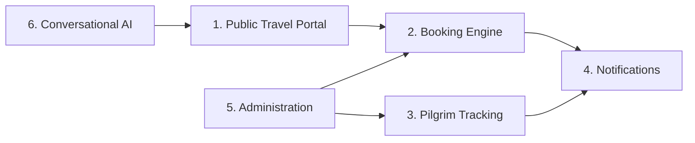
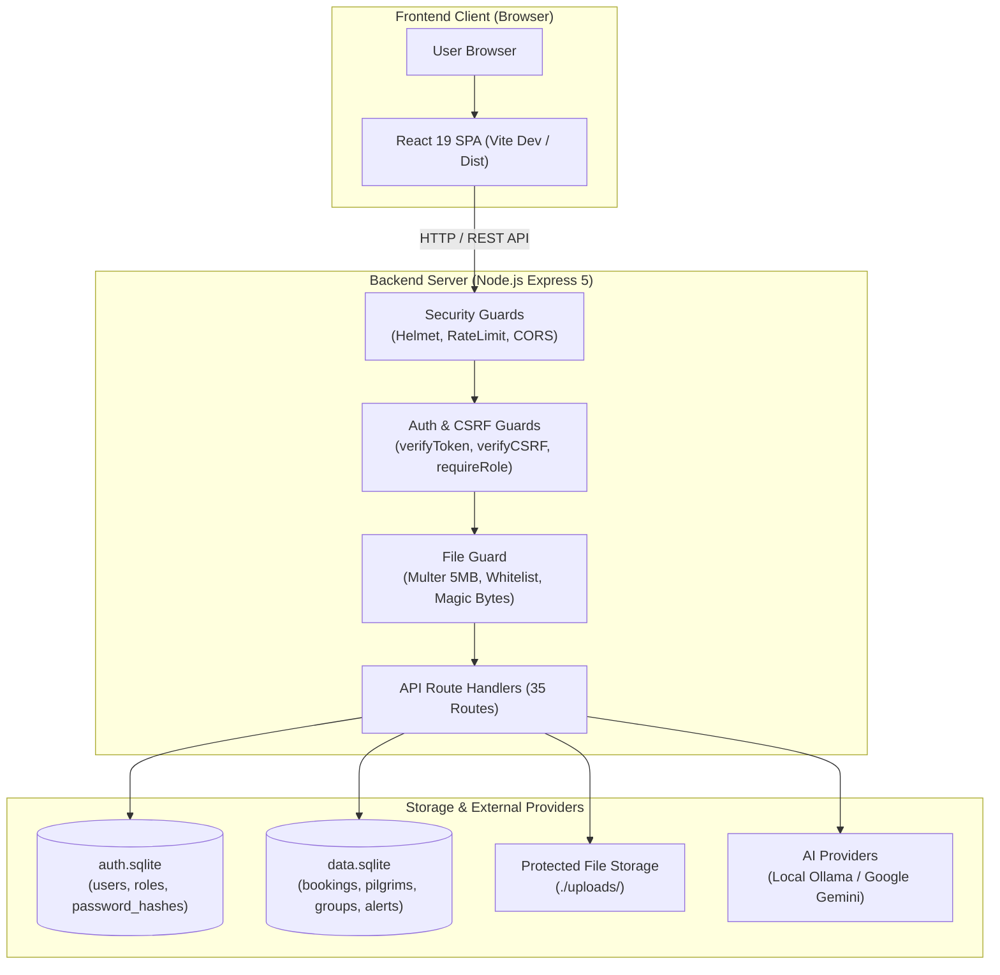
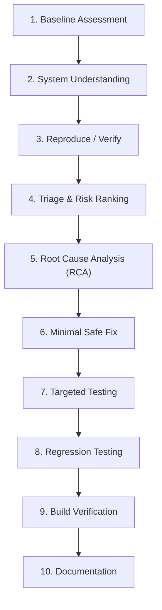

# 1 - Project Overview

[← العودة إلى README الرئيسية](../README.md) | [الفصل التالي: System Architecture →](02-system-architecture.md)

---

## 1.1 Introduction (مقدمة المشروع)

منصة **Kuwait Travel & Tourism Platform** (`kuwait-travel`) هي تطبيق ويب متكامل (Full-Stack Web Application) تم تصميمه لتنظيم وإدارة عمليات وكالات السفر والسياحة، وتقديم خدمات الحجوزات السياحية، وإدارة ومتابعة أفواج المعتمرين والحجاج، بالإضافة إلى توفير لوحة تحكم إدارية متقدمة ومساعد ذكي مدعوم بالذكاء الاصطناعي (AI Voice Assistant).

بدأ المشروع كنموذج أولي عملي (Functional Prototype)، ثم خضع لمرحلة تدقيق وتحليل أمني شاملة (**Application Security Assessment**) وتصليب هندسي منظم (**System Hardening**). ويهدف هذا التوثيق إلى استعراض البنية المعمارية للنظام، العيوب الهندسية والثغرات الأمنية المكتشفة، خطوات الإصلاح الدقيقة، ومنهجية التحقق التجريبي المتبعة عبر مختلف طبقات التطبيق.

---

## 1.2 Project Objectives (أهداف المشروع)

يوازن المشروع بين تحقيق المتطلبات التشغيلية للأعمال وتطبيق أعلى المعايير الهندسية في أمن التطبيقات (Application Security):

### الأهداف الوظيفية (Functional Objectives):
- **بوابة حجز واستكشاف سياحي (Travel Discovery & Booking):** تمكين العملاء من استعراض العروض السياحية المنظمة، طلب التأشيرات الدولية، حجز رحلات الطيران والفنادق، ورفع وثائق السفر.
- **إدارة دورة حياة المعتمرين (Pilgrim Lifecycle Governance):** تزويد وكلاء السفر بأدوات تشغيلية لمتابعة وصول وإقامة المعتمرين داخل المملكة العربية السعودية، وحساب الأيام المتبقية آلياً مقابل الحد الأقصى لصلاحية التأشيرة (90 يوماً)، وإطلاق تنبيهات عند اقتراب انتهاء المدة.
- **إدارة الصلاحيات وتعدد الأدوار (Role-Based Access):** توفير بوابات منفصلة ومخصصة لكل من المستخدم العادي (`user`)، وكيل السفر الميداني (`agent`)، ومدير النظام المركزي (`admin`).
- **خدمات الذكاء الاصطناعي متعدد الوسائط (Multimodal AI Services):** تقديم دعم فني تفاعلي صوتي وكتابي باللغة العربية للعملاء عبر نماذج الذكاء الاصطناعي السحابية والمحلية، مع توليد الصوت آلياً (Text-to-Speech).

### الأهداف الأمنية (Security Objectives):
- **الهندسة الدفاعية (Defensive Engineering):** القضاء على نقاط الضعف المعمارية الأساسية مثل تخزين كلمات المرور كنص صريح، وغياب إجراءات المصادقة (Authentication) والتفويض (Authorization) في خادم Backend.
- **التفويض على مستوى الكائنات (Object-Level Authorization):** ضمان ربط استعلامات المستخدمين ببيانات الجلسة الموثقة من خلال رموز JWT مشفرة، ومنع الوصول غير المصرح به إلى سجلات الحجوزات وجوازات السفر وإشعارات المستخدمين الآخرين.
- **التحقق من صحة الملفات (Secure File Uploads):** بناء خط أنابيب تدقيق متعدد المستويات لرفع وثائق الجوازات، يشمل تدقيق الامتدادات، فحص التواقيع الثنائية (Magic Bytes)، وتحديد أحجام الملفات لمنع هجمات Remote Code Execution و Stored XSS و Denial of Service.
- **التحقق التجريبي الدقيق (Empirical Verification):** التحقق من سلامة كافة التعديلات البرمجية عبر اختبارات مستهدفة (Targeted Tests) واختبارات انحدار (Regression Tests) دون المساس باستقرار المنطق التشغيلي للتطبيق.

---

## 1.3 Main Application Areas (المناطق الوظيفية الأساسية)

ينقسم النظام إلى ست مناطق تشغيلية متكاملة:

### 1. بوابة السفر العامة (Public Travel Portal)
- استعراض الرحلات والوجهات السياحية الدولية (دبي، القاهرة، إسطنبول، ماليزيا، مكة المكرمة، والمدينة المنورة).
- صفحات إرشادية توضح شروط ومتطلبات التأشيرات مع نماذج اتصال واستفسار تفاعلية.
- نظام اختبار صوتي وحسابي (Arithmetic CAPTCHA) لحماية واجهات تسجيل الدخول من هجمات Credential Stuffing والهجمات المؤتمتة.

### 2. محرك الحجوزات (Booking Engine)
- محرك لإدارة حجوزات الطيران، الفنادق، التأشيرات السياحية والتجارية، مساعدة تجديد الجوازات، وحجوزات العمرة.
- واجهة لرفع صور ومستندات الجوازات المرفقة مع الطلب.
- لوحة تحكم خاصة بالمستخدم تتيح متابعة حالة الحجوزات وأرقام المراجع وحالة الاعتماد في الوقت الفعلي.

### 3. إدارة المعتمرين (Pilgrim Management - `PilgrimsManager`)
- لوحة عمل تشغيلية لوكلاء السفر لمتابعة بيانات المعتمرين التابعين لهم.
- حساب فوري لعدد الأيام المنقضية والمتبقية بناءً على تاريخ الدخول والحد الأقصى للتأشيرة (90 يوماً).
- إطلاق تنبيهات تحذيرية باللونين الأصفر والأحمر للمعتمرين الذين تجاوزت إقامتهم 70 يوماً.
- دعم الاستيراد الجماعي لقوائم المعتمرين عبر ملفات Excel (`.xlsx`) وتصدير تقارير HTML باللغة العربية.

### 4. نظام الإشعارات (Notifications System)
- موجز إشعارات فوري داخل التطبيق يعكس تحديثات حالة الحجوزات، صدور التأشيرات، والتنبيهات الإدارية.
- متابعة الإشعارات غير المقروءة مع إمكانية تعليم الإشعارات كمقروءة بشكل فردي أو جماعي لكل مستخدم على حدة.

### 5. لوحة الإدارة العامة (Administration Dashboard - `AdminDashboard`)
- متابعة المؤشرات التشغيلية: إجمالي المستخدمين المسجلين، الحجوزات النشطة، رسائل الاستفسار، والطلبات المعلقة.
- إدارة حسابات المستخدمين وترقية الأدوار الوظيفية بين (`user` $\leftrightarrow$ `agent` $\leftrightarrow$ `admin`).
- استعراض وتحديث حالات الحجوزات ورسائل العملاء وحذف السجلات المكتملة.

### 6. خدمات الذكاء الاصطناعي والمساعد الصوتي (AI & Voice Services - `VoiceAssistant`)
- مساعد محادثة تفاعلي مدمج في الواجهة الأمامية يدعم الإدخال الصوتي والكتابي باللغة العربية.
- تكامل متعدد النماذج: استدلال محلي عبر Ollama (`qwen2.5:1.5b`) لضمان الخصوصية والعمل دون اتصال خارجي، وربط سحابي عبر Google Gemini API للاستفسارات المعقدة.
- تحويل النصوص إلى كلام (Text-to-Speech) في الوقت الفعلي مع نظام تخزين مؤقت لملفات الصوت على الخادم.

---

## 1.4 Technology Stack (جدول حزمة التقنيات)

يعتمد التطبيق على مجموعة من التقنيات الحديثة ضمن بيئة JavaScript و Node.js:

| التقنية (Technology) | الإصدار / المكون (Version / Component) | الدور الفني داخل النظام (Role in Platform) |
|---|---|---|
| **React** | 19.2.0 | بناء الواجهات التفاعلية، إدارة State، والتعامل مع المكونات البرمجية |
| **React Router** | 7.10.0 | إدارة مسارات الواجهة الأمامية والتوجيه المحمي بحسب الصلاحيات |
| **Vite** | 7.2.4 | بناء وحزم ملفات Frontend وتوفير بيئة تطوير سريعة مع Proxy |
| **Node.js** | 24.12.0 (ESM) | بيئة تشغيل Backend غير المتزامنة بدعم Native ECMAScript Modules |
| **Express** | 5.2.1 | إطار عمل الـ REST API وبناء طبقات الـ Middleware والـ Route Handlers |
| **SQLite** | 5.1.1 (`sqlite3` 5.1.7) | قواعد بيانات مدمجة منفصلة مادياً (`auth.sqlite` و `data.sqlite`) |
| **bcryptjs** | 2.4.3 | تشفير وتجزئة كلمات المرور باستخدام Salt بعدد دورات Cost Factor 10 |
| **jsonwebtoken** | 9.0.2 | توليد وتوقيع والتحقق من رموز المصادقة عديمة الحالة (Stateless JWT) |
| **Helmet** | 8.1.0 | تأمين ترويسات HTTP Response Headers ومنع هجمات Clickjacking و XSS |
| **CSRF Protection** | Custom Middleware | تطبيق نمط Double-Submit Cookie مع فحص ترويسة `X-CSRF-Token` |
| **Multer** | 2.0.2 | معالجة طلبات Multipart/form-data وتطبيق قيود الحجم على الملفات |
| **Ollama API** | REST (`localhost:11434`) | تشغيل واستدلال نماذج الذكاء الاصطناعي محلياً عبر أوزان مكممة |
| **Google Gemini** | `@google/genai` 0.1.1 | الاتصال السحابي بنماذج Gemini لتوليد الإجابات الذكية عبر Streaming |
| **LangChain** | 1.2.3 | تجريد نماذج الذكاء الاصطناعي وإدارة قوالب وتنسيق Prompts |

---

## 1.5 High-Level Architecture (الهيكلية المعمارية العامة)

يعتمد التطبيق على معمارية معزولة تفصل بين طبقة الواجهة الأمامية وطبقة الخادم وطبقة التخزين:

### معمارية الفصل المادي لقواعد بيانات SQLite (Dual SQLite Architecture)

بدلاً من وضع كافة الجداول في ملف قاعدة بيانات واحد، تم تقسيم البيانات مادياً عبر ملفين مستقلين:

1. **قاعدة بيانات الحسابات والمصادقة (`auth.sqlite`):**
   - تحتوي على جدول `users` الذي يدير هويات المستخدمين، عناوين البريد الإلكتروني، أرقام الهواتف، الأدوار (`user`, `agent`, `admin`)، أنواع الحسابات (`individual`, `company`)، وهاشات كلمات المرور المشفرة بواسطة Bcrypt.
   - هذه القاعدة معزولة تماماً عن العمليات التشغيلية، ولا يمكن الوصول إليها إلا من خلال مسارات المصادقة والملف الشخصي وتعديل أدوار المستخدمين الإدارية.

2. **قاعدة البيانات التشغيلية للأعمال (`data.sqlite`):**
   - تحتوي على جداول النشاط التجاري والعمليات: `bookings`, `messages`, `destinations`, `pilgrims`, `pilgrim_groups`, و `alerts`.
   - تدير تفاصيل الحجوزات، طلبات التأشيرات، واستعلامات تتبع المعتمرين.

هذا الفصل المادي يقلص بشكل جذري دائرة الاستهداف (Blast Radius)؛ فإذا تعرض استعلام تشغيلي في `data.sqlite` لأي خلل، فإنه يستحيل تقنياً وميكانيكياً على محرك SQLite تنفيذ استعلامات Join أو الوصول إلى بيانات الاعتماد وهاشات كلمات المرور الموجودة داخل ملف `auth.sqlite` المنفصل.

---

## 1.6 Security Assessment Approach (منهجية التقييم والتصليب الأمني)

تم تنفيذ عملية التصليب الأمني للمشروع من خلال مسار هندسي منتظم وموثق:

1. **Baseline Assessment (تحديد نقطة الأساس):** تشغيل واختبار التطبيق في حالته الأولية لتسجيل السلوك الوظيفي والأمني غير المصحح.
2. **System Understanding (فهم معماري للنظام):** تحليل الكود المصدري، فحص سلاسل الـ Middleware، مسارات Express، وتدفق البيانات واستعلامات SQL.
3. **Reproduce / Verify (إعادة إنتاج العيوب):** كتابة سيناريوهات واختبارات تكامل عملية تثبت وجود الخلل الأمني أو التشغيلي في بيئة التشغيل الحية.
4. **Triage & Risk Ranking (تصنيف المخاطر والأولويات):** فصل العيوب الهندسية التشغيلية عن الثغرات الأمنية وترتيبها حسب معايير الخطورة (CVSS / OWASP).
5. **Root Cause Analysis (تحليل السبب الجذري):** تشخيص الخلل البنيوي المباشر المسبب للثغرة بدلاً من علاج المظاهر السطحية.
6. **Minimal Safe Fix (التصحيح الآمن بالحد الأدنى):** تطبيق تعديلات برمجية جراحية محددة لمعالجة السبب الجذري دون التسبب في أية آثار جانبية على منطق الأعمال.
7. **Targeted Testing (الاختبار المستهدف):** إخضاع المكون المعدل لاختبارات إيجابية وسلبية وتجارب تلاعب بالبيانات للتحقق من صمود الحل.
8. **Regression Testing (اختبار الانحدار الشامل):** إعادة تشغيل كافة حزم الاختبارات السابقة لضمان عدم تأثر أية وظائف سابقة بالإصلاحات الجديدة.
9. **Build & Cold Restart Verification (التحقق من البناء وإعادة التشغيل):** إعادة تشغيل الخادم من الصفر (Cold Restart) والتحقق من بناء حزمة الإنتاج (`npm run build`) بنجاح تام.
10. **Documentation (التوثيق الهندسي):** تسجيل كافة مراحل التحليل، الأسباب الجذرية، فروقات الكود، ونتائج التحقق لكل بند.

---

## 1.7 Initial Engineering Findings (النتائج الهندسية الأولية)

خلال مرحلة التدقيق الأولي، تم تصنيف النتائج بدقة إلى فئتين رئيسيتين:

### 1. عيوب الاستقرار والإعدادات الهندسية (Reliability & Engineering Defects)
- **BUG-001 (فقدان بيانات المعتمرين عند إعادة التشغيل):** قيام كود تهيئة قاعدة البيانات بحذف جدول المعتمرين وإعادة إنشائه فارغاً في كل مرة يتم فيها تشغيل الخادم.
- **BUG-002 (غياب مخطط جدول التنبيهات):** عدم تعريف جدول `alerts` في كود تهيئة قاعدة البيانات، مما يتسبب في خطأ 500 وانهيار الخادم عند تشغيل تدقيق مدد الإقامة.
- **BUG-003 (تشتت مسارات قواعد البيانات النسبية):** استخدام مسارات نسبية (`./auth.sqlite`) مما يؤدي إلى إنشاء قواعد بيانات مكررة ومتناقضة حسب مجلد التشغيل (Working Directory).
- **BUG-004 (تعطل تهيئة خدمات الذكاء الاصطناعي):** تقديم تحميل موديولات ES Modules قبل تنفيذ `dotenv.config()`، مما أدى إلى فراغ متغيرات البيئة أثناء تشغيل المكون.
- **BUG-005 (تسريب مفاتيح API في الكود المصدري):** تضمين مفاتيح Google API صريحة داخل ملفات جافا سكريبت على الخادم.

### 2. ثغرات أمن التطبيقات (Application Security Vulnerabilities)
- **SEC-01 (تخزين كلمات المرور كنص صريح - Plaintext Passwords):** حفظ كلمات المرور والتحقق منها كنص غير مشفر داخل قاعدة بيانات المستخدمين.
- **SEC-02 (غياب آليات التفويض والتحكم بالوصول في الـ Backend):** خلو مسارات الخادم الإدارية والتشغيلية من أي تدقيق للمصادقة أو الصلاحيات، والاعتماد فقط على إخفاء الأزرار في الواجهة الأمامية.
- **SEC-03 (ثغرة Broken Object-Level Authorization - BOLA/IDOR):** الوثوق بمعرفات العميل (مثل رقم الهاتف أو معرف الوكيل) في طلبات الاستعلام، مما يسمح لأي مستخدم بقراءة حجوزات وإشعارات وبيانات جوازات مستخدمين آخرين.
- **SEC-04 (رفع الملفات غير المقيد - Unrestricted File Upload):** قبول ملفات بأحجام وامتدادات وأنواع غير مقيدة، وحفظها في مجلد متاح للعامة دون التحقق من هوية الطالب أو توقيع الملف (Magic Bytes).
- **SEC-06 (مخاطر حجب الخدمة الناتجة عن إعدادات Rate Limiting):** فرض حد صارم (100 طلب / 15 دقيقة) يتعارض مع استعلام دوري كل 10 ثوانٍ من الواجهة الأمامية، مما يؤدي لحظر المستخدمين الشرعيين.
- **SEC-07 (سياسة CORS عامة بدون تقييد):** تمكين الوصول من أي نطاق خارجي باستخدام `cors()` دون تقييد النطاقات المصرح لها.

---

## 1.8 Security Remediation Summary (ملخص المعالجات المنجزة)

تم إنجاز التصحيحات الهندسية والأمنية الخمسة الهندسية والأربعة الأمنية الأساسية بالكامل وفق الجدول التالي:

| معرف النتيجة (ID) | نطاق المشكلة (Domain) | استراتيجية الإصلاح المطبقة (Remediation Strategy) | حالة التحقق (Verification) |
|---|---|---|:---:|
| **BUG-001** | Data Persistence | إلغاء `DROP TABLE` المدمر واعتماد Additive Migrations | **VERIFIED** |
| **BUG-002** | Schema Integrity | إضافة تعريف جدول `alerts` داخل دالة التهيئة `initDb()` | **VERIFIED** |
| **BUG-003** | Database Paths | تثبيت مسار مطلق لقواعد البيانات عبر `path.resolve` في `server/db.js` | **VERIFIED** |
| **BUG-004** | Module Loading | إنشاء موديول `server/env.js` لضمان تحميل `.env` قبل كافة الواردات | **VERIFIED** |
| **BUG-005** | Credential Hygiene | تدوير المفاتيح ونقل كافة الأسرار إلى `.env` وتوفير `.env.example` | **VERIFIED** |
| **SEC-01** | Credential Security | ترحيل شامل لحسابات قاعدة البيانات إلى Bcrypt (Cost Factor 10) | **VERIFIED** |
| **SEC-02** | Auth & RBAC | تطبيق كوكيز JWT من نوع HttpOnly، حماية CSRF، ومصفوفة RBAC | **VERIFIED** |
| **SEC-03** | BOLA / IDOR | ربط استعلامات السجلات بـ `req.user.id` المستخرج من الجلسة الموثقة | **VERIFIED** |
| **SEC-04** | Upload Security | سقف 5MB، قائمة بيضاء للامتدادات، فحص Magic Bytes، وحماية المجلد | **VERIFIED** |

*(ملاحظة: تظل النتيجتان SEC-06 و SEC-07 موثقتين كحدود معمارية معروفة ومجدولة للتطوير المستقبلي).*

---

## 1.9 Verification Philosophy (فلسفة ومنهجية التحقق)

لم يتم اعتماد أي إصلاح برمجي كإصلاح مكتمل إلا بعد إخضاعه لحزم اختبارات متقدمة:

- **الاختبارات الإيجابية (Positive Tests):** التحقق من قدرة المستخدمين الشرعيين الذين يملكون صلاحيات وبيانات اعتماد سليمة على إتمام مهامهم بسلاسة.
- **الاختبارات السلبية (Negative Tests):** إرسال رموز تالفة أو منتهية الصلاحية، كلمات مرور خاطئة، ملفات مزيفة الامتداد، وأحجام زائدة للتأكد من حظرها بصورة قاطعة.
- **اختبارات الصلاحيات والحدود (Authorization & Boundary Tests):** التأكد من حصول حسابات `user` على رمز `403 Forbidden` عند محاولة استدعاء مسارات الإدارة أو الوكلاء، ومنع الوكلاء من استعراض معتمري وكلاء آخرين.
- **اختبارات الانحدار (Regression Tests):** تشغيل سيناريوهات الاختبارات القديمة دورياً لضمان عدم تسبب أي كود جديد في كسر وظائف تم إصلاحها سابقاً.
- **اختبارات إعادة التشغيل الباردة (Cold Restart Tests):** إيقاف سيرفر Node.js كلياً ثم إعادة تشغيله للتحقق من استقرار الجداول، تحميل المتغيرات، وتطبيق الصلاحيات دون تدخل يدوي.
- **اختبارات البناء للإنتاج (Production Build Tests):** تجميع الواجهة الأمامية بالكامل بواسطة `npm run build` للتأكد من خلو ملفات التطبيق من أية أخطاء بناء أو استيراد.

---

## 1.10 Repository Documentation Structure (هيكل ملفات التوثيق)

تم توزيع هذا التوثيق الفني في تسعة فصول تخصصية:

1. **[01 - Project Overview](01-project-overview.md):** النظاق العام للمشروع، حزمة التقنيات، ونظرة عامة على المشكلات *(الفصل الحالي)*.
2. **[02 - System Architecture](02-system-architecture.md):** المكونات التقنية، عزل قواعد البيانات، ومسارات تدفق البيانات.
3. **[03 - Security Assessment](03-security-assessment.md):** نتائج التدقيق الأمني الأولي، تقييم التهديدات، وتحليل الأسباب الجذرية.
4. **[04 - System Hardening](04-system-hardening.md):** تصليب استقرار النظام وإصلاح العيوب الإعدادية (BUG-001 إلى BUG-005).
5. **[05 - Authentication & Authorization](05-authentication-and-authorization.md):** معالجة SEC-01 و SEC-02 (تشفير Bcrypt، كوكيز JWT، حماية CSRF، ومصفوفة الصلاحيات).
6. **[06 - BOLA / IDOR Remediation](06-bola-idor-remediation.md):** معالجة SEC-03 (ربط الملكية ومنع التلاعب بالمعرفات في الحجوزات والمعتمرين).
7. **[07 - Secure File Uploads](07-secure-file-uploads.md):** معالجة SEC-04 (سلسلة فحص الملفات المرفوعة، فحص التواقيع، وتأمين التخزين).
8. **[08 - Security Testing](08-security-testing.md):** منهجية الاختبار، الحزم المؤتمتة، وأعداد الاختبارات التفصيلية.
9. **[09 - Final Security Status](09-final-security-status.md):** الموقف الأمني النهائي المعتمد، الضوابط الأمنية، والحدود التشغيلية المتبقية.

---

## 1.11 Next Chapter (الفصل التالي)

انتقل إلى دراسة المعمارية التفصيلية للنظام:  
👉 **[2 - System Architecture](02-system-architecture.md)**
