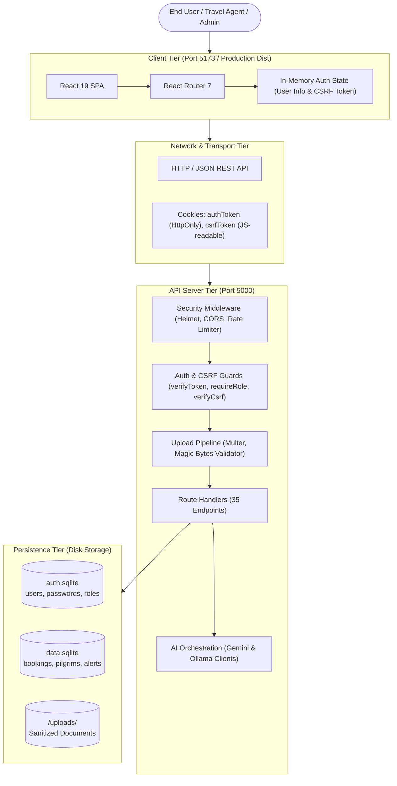
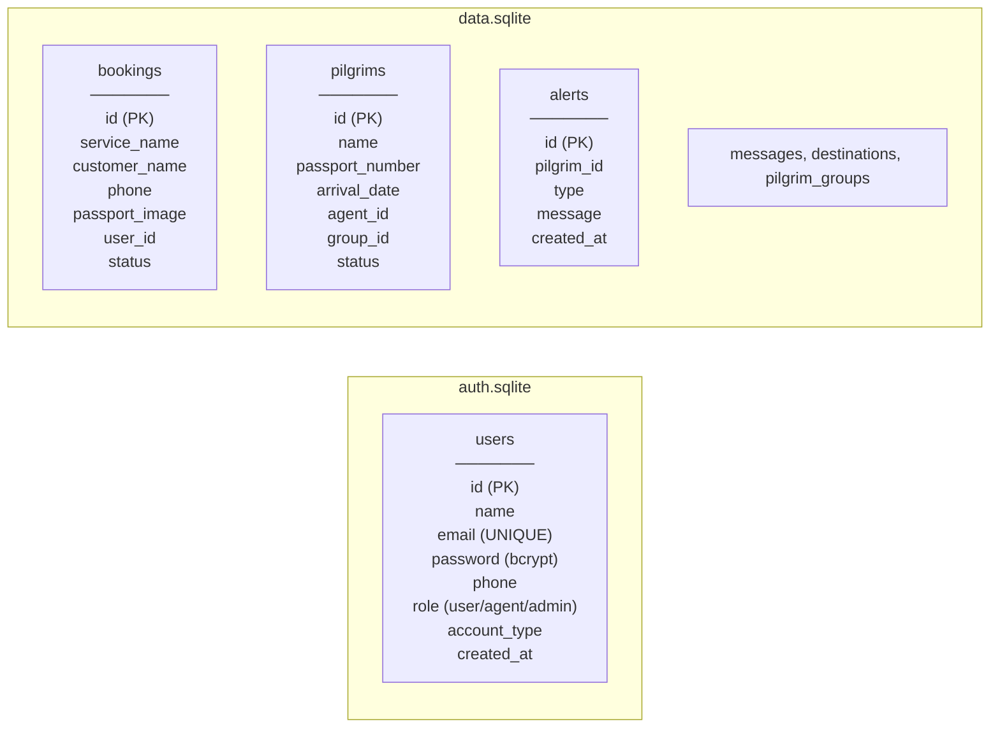
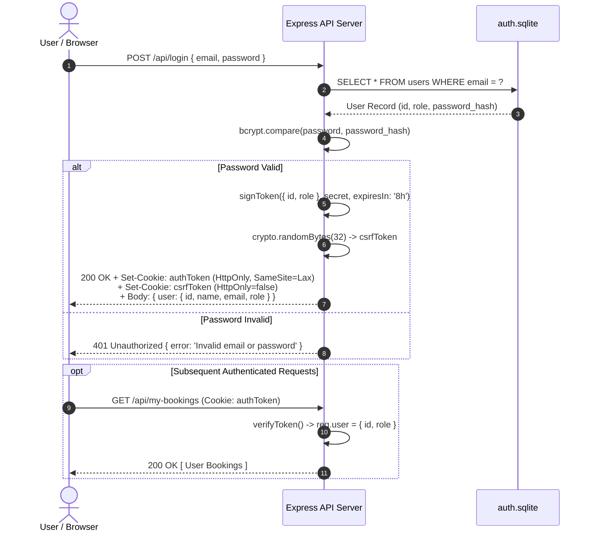
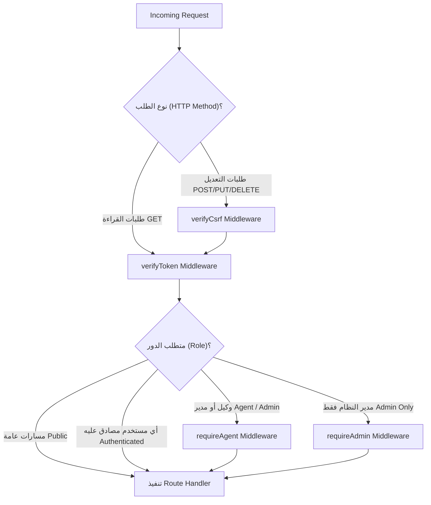
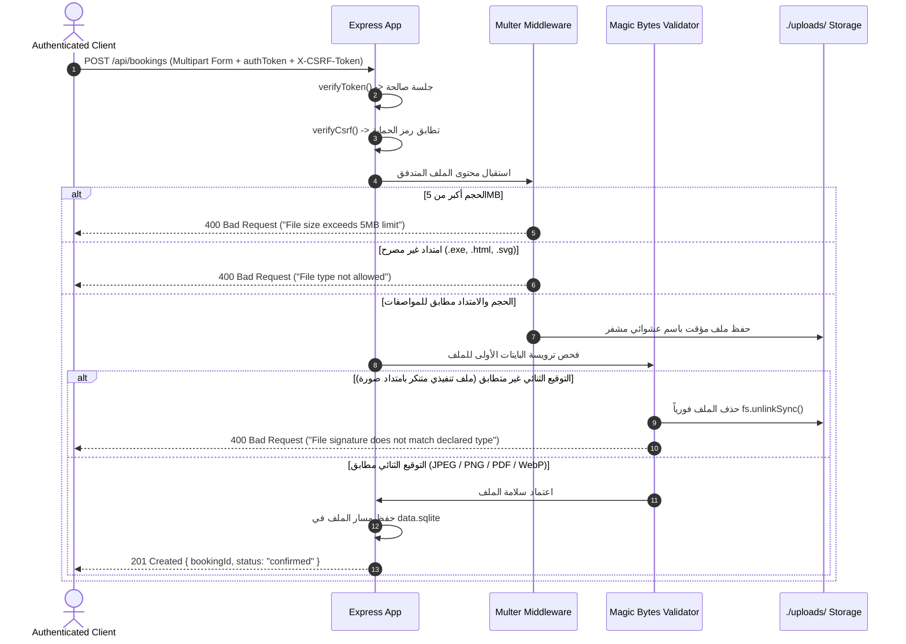
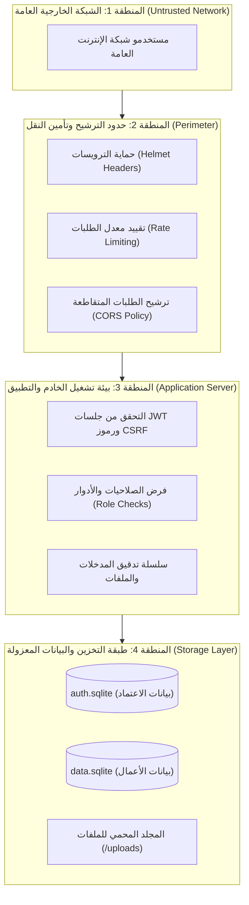

# 2 - System Architecture

[← العودة إلى الفصل 1: Project Overview](01-project-overview.md) | [الفصل التالي: Security Assessment →](03-security-assessment.md)

---

## 2.1 Overview (نظرة عامة على المعمارية)

يعتمد نظام **Kuwait Travel & Tourism Platform** على معمارية معزولة تعتمد على نمط العميل والخادم (Client-Server Architecture). تتكون الواجهة الأمامية من تطبيق صفحة واحدة (Single Page Application - SPA) مبني بواسطة React 19 ويتم تجميعه وتقديمه عبر Vite. بينما تتكون الواجهة الخلفية من خادم REST API مبني بواسطة Express 5 ويعمل على بيئة تشغيل Node.js بالاعتماد الكامل على وحدات ECMAScript Modules (ESM). وتتم إدارة البيانات عبر الفصل المادي التام بين قاعدتي بيانات SQLite مستقلتين؛ مما يضمن عزل بيانات الهوية الحساسة وكلمات المرور عن السجلات التشغيلية للمنصة.

---

## 2.2 Frontend (معمارية الواجهة الأمامية)

تم بناء الواجهة الأمامية كـ Single Page Application يعتمد على Client-Side Rendering (CSR) باستخدام React 19 ونظام التوجيه React Router 7:

- **هيكلية المكونات (Component Structure):**
  - `src/App.jsx`: المكون الجذري للتطبيق، يحتوي على منطق التوجيه العام، شريط التنقل الرئيسي، عرض الرحلات والعروض السياحية الديناميكية، نوافذ الحجز المنبثقة (Modals)، ونوافذ تسجيل الدخول والحسابات.
  - `src/AdminDashboard.jsx`: لوحة الإدارة العامة المخصصة لمديري النظام، تتيح مراقبة المؤشرات والإحصائيات، إدارة وتحديث أدوار المستخدمين، مراجعة الحجوزات والرسائل الواردة.
  - `src/UserDashboard.jsx`: بوابة العميل لعرض بيانات الملف الشخصي واستعراض الحجوزات المسجلة باسم المستخدم.
  - `src/PilgrimsManager.jsx`: بوابة تشغيلية متخصصة لوكلاء السفر لمتابعة مدد إقامة المعتمرين، رفع ملفات Excel الجماعية، ومتابعة تنبيهات تجاوز مدة 70 يوماً وتصدير التقارير.
  - `src/VoiceAssistant.jsx`: واجهة المساعد الصوتي التفاعلي، تستخدم Web Speech API لتسجيل الصوت والتعرف على الكلام، والتواصل مع الـ Backend عبر تقنية Streaming لتوليد الردود وتشغيل ملفات الصوت.
- **إدارة الحالة وبيانات الاعتماد (State Management & Credentials):**
  - يتم تخزين بيانات المستخدم المصادق عليها فقط داخل ذاكرة React المؤقتة (`useState`)، والتي تتم تهيئتها عند تشغيل التطبيق بالاستعلام من نقطة النهاية `GET /api/auth/me`.
  - **لا يتم تخزين أي رموز JWT أو بيانات حساسة داخل `localStorage` أو `sessionStorage` نهائياً**، وذلك لإحباط محاولات سرقة الجلسات عبر ثغرات Cross-Site Scripting (XSS).
  - يتولى المتصفح تلقائياً إدارة إرسال الكوكي المؤمن `authToken` المزود بخاصية `HttpOnly`. وبالنسبة للعمليات التي تغير حالة البيانات (POST, PUT, DELETE)، يقرأ كود JavaScript قيمة الكوكي غير المحمي `csrfToken` ويقوم بحقنه كترويسة `X-CSRF-Token` في طلب HTTP.

---

## 2.3 Backend (معمارية الواجهة الخلفية)

تم بناء الواجهة الخلفية عبر إطار عمل Express 5 الذي يعمل في بيئة Node.js الحديثة:

- **نقطة الدخول ودورة التهيئة (`server/index.js`):**
  - تطبيق معايير الأمان المتقدمة على ترويسات الاستجابة باستخدام `helmet()`.
  - تفعيل محدد معدل الطلبات العالمي (Global Rate Limiter) بمعدل 100 طلب لكل 15 دقيقة لكل عنوان IP.
  - تجهيز مفسرات الطلبات: `express.json()`, `express.urlencoded({ extended: true })`, و `cookieParser()`.
  - الاتصال بقاعدتي بيانات SQLite وتنفيذ ترقيات الجداول التراكمية (Additive Migrations).
- **الخدمات والطبقات الوسيطة (Modular Services & Middleware):**
  - `server/middleware/auth.js`: يوفر دوال التحقق الصارمة: `verifyToken`, `requireAdmin`, `requireAgent`, و `verifyCsrf`.
  - `server/db.js`: مدير الاتصال الموحد لقواعد البيانات، يضمن تثبيت المسارات المطلقة الآمنة وحل مشكلة المسارات النسبية المتناقضة.
  - `server/env.js`: موديول التحميل الاستباقي لملف `.env` لضمان توفر كافة المتغيرات قبل استيراد موديولات الخدمات الأخرى في بيئة ES Modules.
  - `server/aiService.js`, `server/geminiService.js`, `server/ollamaService.js`: طبقات الاتصال والربط بنماذج الذكاء الاصطناعي السحابية والمحلية.
  - `server/ttsService.js`: خدمة توليد وتحويل النصوص إلى ملفات صوتية وحفظها مؤقتاً في القرص الصلب (`audio_cache/`).

---

## 2.4 Database Separation (الفصل المادي لقواعد البيانات)

تطبق المنصة عزلاً مادياً صارماً بين سجلات الحسابات والبيانات التشغيلية:

### الفوائد المعمارية لهذا الفصل:
1. **عزل بيانات الاعتماد (Credential Isolation):** في حال حدوث أي ثغرة استعلامية أو خطأ منطقي داخل قاعدة البيانات التشغيلية `data.sqlite`، لا يستطيع محرك SQLite تقنياً ومادياً الوصول إلى قاعدة `auth.sqlite` أو تنفيذ Cross-Database Queries، مما يحمي هاشات كلمات المرور من الاستخراج.
2. **استقلالية النسخ الاحتياطي (Independent Backups):** إمكانية أخذ نسخ احتياطية وتدوير أسرار قاعدة الحسابات بشكل مستقل تماماً عن السجلات اليومية للحجوزات.
3. **سلامة المخطط الهيكلي (Schema Integrity):** منع حدوث أية أخطاء قفل للجداول (Database Locks) أثناء التعديلات الهيكلية على الجداول التشغيلية.

---

## 2.5 Authentication Flow (مسار المصادقة وتسجيل الدخول)

تعتمد المصادقة على رموز JWT عديمة الحالة (Stateless)، ويتم حفظها حصرياً داخل HttpOnly Cookies:

### خصائص ملفات تعريف الارتباط (Cookie Attributes):
- **ملف تعريف الارتباط للمصادقة (`authToken`):**
  - `httpOnly: true`: يمنع كود JavaScript و `document.cookie` من قراءة أو استخراج التوكن، مما يبطل مخاطر XSS Token Theft.
  - `sameSite: 'lax'`: يوفر حماية متقدمة من هجمات CSRF أثناء طلبات النطاقات الخارجية، مع السماح بالتنقلات الطبيعية من الروابط الخارجية.
  - `secure: process.env.NODE_ENV === 'production'`: يفرض إرسال الكوكي عبر اتصالات HTTPS المشفرة فقط في بيئة الإنتاج.
  - `maxAge: 8 hours`: صلاحية زمنية محددة تنتهي بعدها الجلسة تلقائياً.
- **ملف تعريف الارتباط لحماية التزوير (`csrfToken`):**
  - `httpOnly: false`: متاح لقراءة JavaScript حتى تتمكن واجهة React من استخراجه وإرساله داخل ترويسة `X-CSRF-Token` مع كل طلب POST أو PUT أو DELETE.

---

## 2.6 Authorization Flow (مسار التفويض والتحكم بالوصول)

يتميز نظام التفويض في المنصة بأنه **متعدد المستويات ومبني على السياق الوظيفي**. لا تشترك جميع المسارات في نفس الـ Middleware، بل يتم تأمين كل نقطة نهاية بناءً على مبدأ الحد الأدنى من الصلاحيات (Least Privilege):

### تصنيف المسارات الإجمالية (35 نقطة نهاية):
1. **مسارات عامة ومتاحة للجميع (10 مسارات):** فحص الصحة (`/api/test`, `/api/health`, `/api/ai/status`)، استعراض العروض والرحلات (`/api/destinations`, `/api/offers`)، إرسال استفسار (`/api/contact`)، اختبارات التحقق (`/api/captcha`, `/api/captcha/audio`)، وتسجيل الدخول والتسجيل الجديد (`/api/login`, `/api/register`).
2. **مسارات تتطلب مصادقة المستخدم (12 مساراً):** استرجاع بيانات الحساب (`/api/auth/me`)، تسجيل الخروج (`/api/logout`)، استعراض الوكلاء والمجموعات (`/api/agents`, `/api/groups`)، استعراض الحجوزات الخاصة والإشعارات (`/api/my-bookings`, `/api/notifications`, `/api/notifications/read`)، إنشاء حجز جديد (`/api/bookings`)، استعراض المعتمرين وتصدير التقارير (`/api/pilgrims`, `/api/pilgrims/export-pdf`)، واستخدام المحادثة والذكاء الاصطناعي والصوتيات (`/api/ai/chat`, `/api/ai/generate`, `/api/tts`).
3. **مسارات تشغيلية لوكلاء السفر والمديرين (5 مسارات):** إنشاء المجموعات والمعتمرين (`POST /api/groups`, `POST /api/pilgrims`, `POST /api/pilgrims/bulk`)، فحص تنبيهات مدد الإقامة (`GET /api/pilgrims/check-alerts`)، وتحديث حالات المعتمرين (`PUT /api/pilgrims/:id/status`).
4. **مسارات حصرية لمديري النظام (8 مسارات):** استعراض الإحصائيات العامة (`GET /api/admin/stats`)، إدارة وتعديل أدوار المستخدمين (`GET /api/admin/users`, `PUT /api/admin/users/:id/role`)، إدارة الحجوزات الإدارية وتحديثها (`GET /api/admin/bookings`, `PUT /api/admin/bookings/:id`)، مراجعة رسائل العملاء وحذفها (`GET /api/admin/messages`, `DELETE /api/admin/messages/:id`)، وبث الإشعارات الإدارية (`POST /api/admin/send-notification`).

---

## 2.7 File Upload Flow (مسار رفع وتدقيق الملفات)

تمر مستندات جوازات السفر المرفوعة مع الحجوزات عبر خط أنابيب تدقيق هندسي دفاعي صارم قبل السماح بحفظها في القرص:

---

## 2.8 Security Boundaries (الحدود الأمنية للنظام)

يفرض النظام أربعة مستويات من الحدود الأمنية الصارمة:

---

## 2.9 Design Principles (المبادئ الهندسية المتبعة)

تستند معمارية النظام إلى خمسة مبادئ هندسية وأمنية أساسية:

1. **الدفاع في العمق (Defense in Depth):** ترتيب الضوابط الأمنية بالتتابع (Rate Limiting $\rightarrow$ Security Headers $\rightarrow$ JWT Verification $\rightarrow$ CSRF Check $\rightarrow$ Role Inspection $\rightarrow$ Magic Bytes Validation).
2. **الحد الأدنى من الصلاحيات (Least Privilege):** لا يُمنح أي مستخدم أو دور وصولاً إلا لما يتطلبه إنجاز مهمته الوظيفية المحددة.
3. **الإغلاق عند الفشل (Fail-Closed Default):** إذا واجه الخادم أي رمز مصادقة تالف أو منتهي الصلاحية أو غير موقع بالمفتاح السري المعتمد، يتم رفض الطلب فوراً برمز `401 Unauthorized`.
4. **انعدام الثقة بمدخلات العميل (Zero Client Trust):** لا يتم الاعتماد على أرقام الهواتف أو معرفات الوكلاء المرسلة في الـ Query Parameters؛ بل تستمد الهوية حصراً من رمز الـ JWT الذي يفك الخادم تشفيره ويوثقه.
5. **فصل المسؤوليات (Separation of Concerns):** عزل قواعد بيانات المصادقة عن السجلات التشغيلية وعن تخزين الملفات وخدمات استدعاء نماذج الذكاء الاصطناعي.

---

## 2.10 Next Chapter (الفصل التالي)

انتقل لمراجعة نتائج التدقيق الأمني المبدئي وتحليل الثغرات المكتشفة:  
👉 **[3 - Security Assessment](03-security-assessment.md)**
