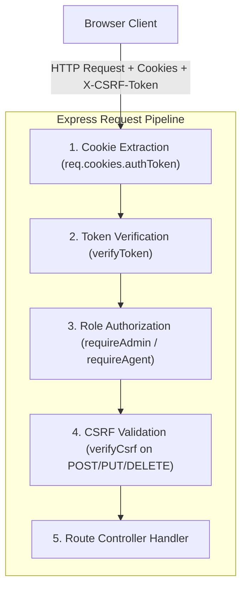

# 5 - Authentication & Authorization

[← العودة إلى الفصل 4: System Hardening](04-system-hardening.md) | [الفصل التالي: BOLA / IDOR Remediation →](06-bola-idor-remediation.md)

---

## 5.1 Overview (نظرة عامة على أنظمة المصادقة والتفويض)

كشفت مرحلة التقييم الأمني الأولي عن ثغرتين حرجتين تمسان جوهر منظومة الحماية والتحكم بالوصول في المنصة:
1. **SEC-01:** تخزين كلمات المرور ومقارنتها كنص صريح (Plaintext Passwords) دون أية تجزئة أو تشفير.
2. **SEC-02:** الغياب الكامل لآليات التفويض والمصادقة في خادم Backend، مما جعل المسارات الإدارية والتشغيلية متاحة لأي طرف خارجي.

يستعرض هذا الفصل عملية الترحيل التشفيري إلى خوارزمية `bcrypt`، وتصميم منظومة مصادقة متطورة تعتمد على رموز JWT عديمة الحالة (Stateless) ومحفوظة داخل HttpOnly Cookies، إلى جانب تطبيق نظام التحكم بالوصول المبني على الأدوار (Role-Based Access Control - RBAC) مع حماية ضد هجمات تزوير الطلبات عبر نمط Double-Submit CSRF.

---

## 5.2 SEC-01: تشفير كلمات المرور والترحيل إلى Bcrypt

### الضعف الأولي في النظام (The Original Weakness)
في النسخة الأولية، كانت كلمات المرور لجميع حسابات النظام (المستخدمين العاديين، وكلاء السفر، ومديري النظام) تُحفظ كنصوص صريحة مباشرة في جدول `users` داخل `auth.sqlite`. وأثناء تسجيل الدخول، كان المسار البرمجي يقوم بمطابقة نصية مجردة:
```javascript
// نقطة الضعف الأولية في مسار POST /api/login
if (!user || user.password !== password) {
    return res.status(400).json({ error: 'Invalid email or password' });
}
```
كانت هذه الممارسة تجعل أي تسريب لملف قاعدة البيانات يعرض كافة الحسابات للاختراق المباشر.

### معمارية الترحيل إلى Bcrypt (Bcrypt Migration Architecture)
لمعالجة SEC-01، تم تطبيق مكتبة `bcryptjs` مع تثبيت معامل التعقيد عند Cost Factor 10 ($2^{10} = 1024$ جولة توليد للمفاتيح):

1. **الترحيل التراكمي في عملية واحدة (Transactional & Idempotent Migration):**
   - تم إنشاء سكريبت ترحيل آمن يقوم بفحص كل حساب مسجل في `auth.sqlite`.
   - يتأكد السكريبت أولاً مما إذا كانت كلمة المرور مشفرة مسبقاً (تبدأ بالبادئة المعيارية `$2a$` أو `$2b$`).
   - بالنسبة للكلمات غير المشفرة، يتم توليد الهاش عبر `bcrypt.hash(pwd, 10)`.
   - قبل اعتماد وحفظ التحديث في قاعدة البيانات، ينفذ السكريبت فحص مطابقة فوري عبر `bcrypt.compare(pwd, hash)` لضمان عدم تلف الحسابات داخل Transaction محكم.
2. **تأمين مسار التسجيل الجديد (Registration Pipeline):**
   - في المسار `POST /api/register`، يتم تشفير كلمة المرور فور استلامها وقبل كتابة استعلام الحفظ:
   ```javascript
   const hashedPassword = await bcrypt.hash(password, 10);
   await authDb.run(
       "INSERT INTO users (name, email, password, phone, account_type, role) VALUES (?, ?, ?, ?, ?, ?)",
       [name, email, hashedPassword, phone, account_type || 'individual', 'user']
   );
   ```
3. **تأمين مسار تسجيل الدخول (Login Verification):**
   - في المسار `POST /api/login`، تتم المقارنة بطريقة مقاومة لهجمات التوقيت الزمني (Constant-Time Comparison):
   ```javascript
   const isMatch = await bcrypt.compare(password, user.password);
   if (!isMatch) {
       return res.status(401).json({ error: 'Invalid email or password' });
   }
   ```
4. **منع تسريب كلمات المرور (Password Leakage Prevention):**
   - تم تعديل كافة استعلامات `SELECT` في مسارات الحسابات ولوحة الإدارة لاستبعاد حقل `password` تماماً:
   ```javascript
   const user = await authDb.get(
       "SELECT id, name, email, phone, role, account_type FROM users WHERE id = ?",
       [req.user.id]
   );
   ```
   - تم التحقق من أن استجابات API وسجلات Console Logs لا تتضمن حقل كلمة المرور مطلقاً.

---

## 5.3 SEC-02: بنية المصادقة والتفويض عبر الخادم

### الضعف الأولي في النظام (The Original Weakness)
كانت الصلاحيات تدار في الواجهة الأمامية فقط عبر إخفاء الأزرار للمستخدم العادي في واجهة React. أما في الواجهة الخلفية، فقد كانت كافة مسارات لوحة التحكم الإدارية ومسارات إدارة المعتمرين مفتوحة بالكامل أمام أي طلب شبكي دون مصادقة.

### المعمارية الأمنية المعتمدة (Architectural Solution)
تم اعتماد معمارية مصادقة عديمة الحالة (Stateless Authentication) قائمة على JSON Web Tokens (JWT) المحفوظة حصرياً داخل كوكيز مؤمنة بخاصية `HttpOnly` بدلاً من استخدام `localStorage`:



### 1. توليد التوكن وحفظه في الكوكي (Token Generation & Storage)
عند نجاح عملية تسجيل الدخول، يُصدر الخادم رمز JWT موقعاً يتضمن فقط الحد الأدنى من بيانات الهوية:
```javascript
function signAuthToken(userId, userRole) {
    return jwt.sign(
        { id: userId, role: userRole },
        process.env.JWT_SECRET,
        { algorithm: 'HS256', expiresIn: '8h' }
    );
}
```
ويتم إرسال التوكن في كوكي مزود بأعلى معايير الحماية:
```javascript
function setAuthCookie(res, token) {
    const isProd = process.env.NODE_ENV === 'production';
    res.cookie('authToken', token, {
        httpOnly: true,
        secure: isProd,
        sameSite: isProd ? 'strict' : 'lax',
        maxAge: 8 * 60 * 60 * 1000, // 8 hours
        path: '/'
    });
}
```

> [!IMPORTANT]
> **لماذا تم تفضيل `HttpOnly` Cookies على `localStorage`؟**  
> التوكنات المخزنة في `localStorage` أو `sessionStorage` تكون متاحة للقراءة المباشرة من قِبل أي كود JavaScript يعمل في الصفحة؛ مما يعني أنه في حال حدوث ثغرة XSS يتم سحب التوكن واختطاف الجلسة فورياً. أما عند حفظ التوكن داخل `HttpOnly Cookie`، فإن المتصفح يمنع قراءته برمجياً منعاً باتاً (`document.cookie` تعجز عن رؤيته)، مما يحبط محاولات سرقة الرموز تماماً.

### 2. الحماية المزدوجة من التزوير (Double-Submit CSRF Protection)
نظراً لأن المتصفح يقوم بإرسال ملفات الكوكي تلقائياً مع الطلبات، تم بناء نظام حماية وفق معيار Double-Submit Cookie Pattern لحماية مسارات التعديل الحساسة (`POST`, `PUT`, `DELETE`):

1. **إصدار كوكي CSRF:** عند تسجيل الدخول، يُصدر الخادم كوكياً إضافياً باسم `csrfToken` يحتوي على 32 بايت مشفر عشوائياً.
2. **قابلية القراءة في الـ Frontend:** يكون هذا الكوكي بخاصية `httpOnly: false` حتى تتمكن واجهة React من قراءته وحقنه داخل ترويسة الطلب `X-CSRF-Token`.
3. **التدقيق في الخادم (`verifyCsrf Middleware`):**
   ```javascript
   export function verifyCsrf(req, res, next) {
       const tokenFromCookie = req.cookies?.csrfToken;
       const tokenFromHeader = req.headers['x-csrf-token'];
       if (!tokenFromCookie || !tokenFromHeader || tokenFromCookie !== tokenFromHeader) {
           return res.status(403).json({ error: 'CSRF token missing or mismatch' });
       }
       next();
   }
   ```
   لا تستطيع أي مواقع خارجية خبيثة قراءة كوكي الضحية (بفعل قيود Same-Origin Policy للمتصفحات)، وبالتالي تعجز عن تزوير الترويسة المطابقة في طلباتها الخبيثة.

### 3. طبقات التحقق من الصلاحيات والأدوار (RBAC Middleware)

تتكامل ثلاث طبقات وسطية مرنة لإدارة الصلاحيات:
- **`verifyToken`:** يستخرج `authToken` من الكوكيز، ويفك تشفيره ويتحقق من سلامة التوقيع وصلاحية الوقت، ثم يربط هوية المستخدم بـ `req.user = { id, role }`.
- **`requireAdmin`:** يعمل بعد `verifyToken`، ويتأكد من أن `req.user.role === 'admin'`، ويرفض الوصول برمز `403 Forbidden` للمستخدمين والوكلاء.
- **`requireAgent`:** يتأكد من أن الرتبة هي وكيل أو مدير نظام (`admin` أو `agent`)، ويمنع المستخدمين العاديين برمز `403 Forbidden`.

---

## 5.4 Authoritative Route Security Matrix (مصفوفة أمان المسارات الشاملة)

تم تصنيف كافة مسارات الخادم الـ 35 بدقة متناهية ودون أي تداخل:

| نوع الطلب | مسار نقطة النهاية (Route Path) | متطلب المصادقة (Auth) | متطلب الدور (Role) | حماية CSRF | التصنيف الأمني المعتمد |
|:---:|---|:---:|:---:|:---:|:---:|
| `GET` | `/api/test` | None | Public | No | Intentionally Public |
| `GET` | `/api/health` | None | Public | No | Intentionally Public |
| `GET` | `/api/destinations` | None | Public | No | Intentionally Public |
| `GET` | `/api/offers` | None | Public | No | Intentionally Public |
| `POST` | `/api/contact` | None | Public | No | Intentionally Public |
| `GET` | `/api/captcha` | None | Public | No | Intentionally Public |
| `GET` | `/api/captcha/audio` | None | Public | No | Intentionally Public |
| `POST` | `/api/register` | None | Public | No | Intentionally Public |
| `POST` | `/api/login` | None | Public | No | Intentionally Public |
| `GET` | `/api/ai/status` | None | Public | No | Intentionally Public |
| `GET` | `/api/auth/me` | `verifyToken` | Any User | No | Authenticated |
| `POST` | `/api/logout` | None (مسح الكوكيز) | Public | No | Authenticated / Public |
| `GET` | `/api/agents` | `verifyToken` | Any User | No | Authenticated |
| `GET` | `/api/groups` | `verifyToken` | Any User | No | Authenticated |
| `GET` | `/api/my-bookings` | `verifyToken` | Any User (سجلاته فقط) | No | Authenticated |
| `POST` | `/api/bookings` | `verifyToken` | Any User | `verifyCsrf` | Authenticated + CSRF |
| `GET` | `/api/notifications` | `verifyToken` | Any User (سجلاته فقط) | No | Authenticated |
| `POST` | `/api/notifications/read` | `verifyToken` | Any User (سجلاته فقط) | `verifyCsrf` | Authenticated + CSRF |
| `GET` | `/api/pilgrims` | `verifyToken` | Any User (مقيد الصلاحية) | No | Authenticated |
| `GET` | `/api/pilgrims/export-pdf` | `verifyToken` | Any User (مقيد الصلاحية) | No | Authenticated |
| `POST` | `/api/ai/generate` | `verifyToken` | Any User | No | Authenticated |
| `POST` | `/api/ai/chat` | `verifyToken` | Any User | No | Authenticated |
| `POST` | `/api/tts` | `verifyToken` | Any User | No | Authenticated |
| `POST` | `/api/groups` | `verifyToken` | Agent / Admin | `verifyCsrf` | Agent / Admin + CSRF |
| `POST` | `/api/pilgrims` | `verifyToken` | Agent / Admin | `verifyCsrf` | Agent / Admin + CSRF |
| `POST` | `/api/pilgrims/bulk` | `verifyToken` | Agent / Admin | `verifyCsrf` | Agent / Admin + CSRF |
| `GET` | `/api/pilgrims/check-alerts` | `verifyToken` | Agent / Admin | No | Agent / Admin |
| `PUT` | `/api/pilgrims/:id/status` | `verifyToken` | Agent / Admin | `verifyCsrf` | Agent / Admin + CSRF |
| `GET` | `/api/admin/stats` | `verifyToken` | Admin Only | No | Admin Only |
| `GET` | `/api/admin/users` | `verifyToken` | Admin Only | No | Admin Only |
| `PUT` | `/api/admin/users/:id/role` | `verifyToken` | Admin Only | `verifyCsrf` | Admin Only + CSRF |
| `GET` | `/api/admin/messages` | `verifyToken` | Admin Only | No | Admin Only |
| `DELETE` | `/api/admin/messages/:id` | `verifyToken` | Admin Only | `verifyCsrf` | Admin Only + CSRF |
| `GET` | `/api/admin/bookings` | `verifyToken` | Admin Only | No | Admin Only |
| `PUT` | `/api/admin/bookings/:id` | `verifyToken` | Admin Only | `verifyCsrf` | Admin Only + CSRF |
| `POST` | `/api/admin/send-notification`| `verifyToken` | Admin Only | `verifyCsrf` | Admin Only + CSRF |

---

## 5.5 Verification & Security Testing (نتائج اختبارات التحقق)

تم التحقق من نجاح تطبيق SEC-01 و SEC-02 من خلال حزم اختبارات مؤتمتة:

### نتائج اختبارات SEC-01 (اجتياز 12 اختباراً / 0 إخفاق):
- فحص قواعد البيانات: التأكد من ترقية جميع الحسابات الـ 15 إلى هاشات Bcrypt صالحة تبدأ بـ `$2a$` أو `$2b$`.
- اختبار المصادقة: تسجيل الدخول السليم بكلمات المرور الصحيحة، ورفض الكلمات الخاطئة برمز `401 Unauthorized`.
- اختبار التسجيل الجديد: التأكد من حفظ حسابات المستخدمين الجدد بهاشات مشفرة فور إنشائها.
- اختبار منع التسريب: التأكد من خلو استجابات نقاط النهاية من حقول كلمات المرور نهائياً.

### نتائج اختبارات SEC-02 (اجتياز 36 اختباراً / 0 إخفاق):
- **الوصول غير المصادق عليه:** طلب المسارات الـ 25 المحمية دون كوكي المصادقة؛ وتم رفضها بنسبة 100% برمز `401 Unauthorized`.
- **محاولات تصعيد الصلاحيات (Privilege Escalation):** تسجيل الدخول بحساب `user` عادي ومحاولة الوصول للمسارات الإدارية؛ تم حظرها بنسبة 100% برمز `403 Forbidden`.
- **فرض حماية CSRF:** إرسال طلبات تعديل دون ترويسة `X-CSRF-Token` أو برمز غير متطابق مع الكوكي؛ تم حظرها بالكامل برمز `403 Forbidden`.
- **اختبار التلاعب بالرموز (Token Tampering):** تعديل حقل الدور (Role) في التوكن من `user` إلى `admin` دون التوقيع بالمفتاح السري؛ فشل التحقق وتم رفض الطلب برمز `401 Unauthorized`.
- **سلوك تسجيل الخروج:** استدعاء مسار `POST /api/logout` والتحقق من إصدار الخادم لترويسات مسح وتصفير كوكيز `authToken` و `csrfToken`.

---

## 5.6 Next Chapter (الفصل التالي)

انتقل لدراسة معالجة ثغرات Broken Object-Level Authorization (BOLA/IDOR) وحماية بيانات الحجوزات والمعتمرين:  
👉 **[6 - BOLA / IDOR Remediation](06-bola-idor-remediation.md)**
