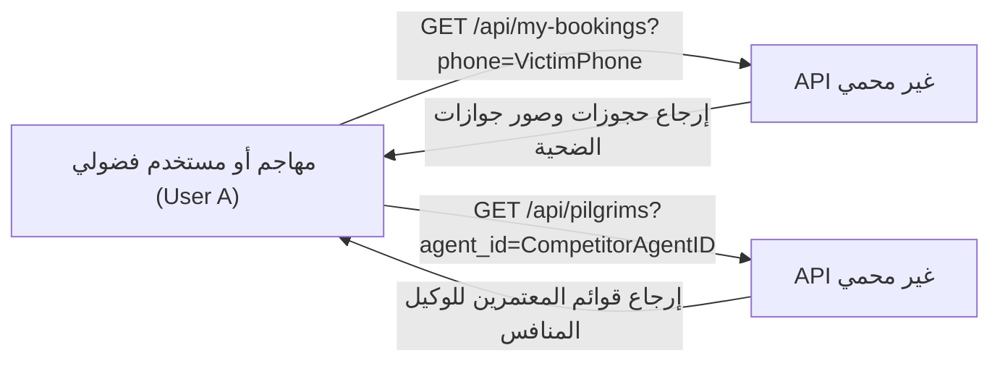

# 6 - BOLA / IDOR Remediation

[← العودة إلى الفصل 5: Authentication & Authorization](05-authentication-and-authorization.md) | [الفصل التالي: Secure File Uploads →](07-secure-file-uploads.md)

---

## 6.1 Overview (نظرة عامة على ثغرات BOLA و IDOR)

تحدث ثغرات **Broken Object-Level Authorization (BOLA)**، والمعروفة تاريخياً باسم Insecure Direct Object References (IDOR)، عندما يعتمد التطبيق على المعرفات المباشرة القادمة من طرف العميل للتحقق من الأحقية في الوصول إلى السجلات، بدلاً من التحقق الصارم في الخادم من ملكية المستخدم للبيانات المطلوبة.

أثناء التقييم الأمني للمنصة، تم رصد الثغرة **SEC-03** كواحدة من أخطر نقاط الضعف عبر ست نقاط نهاية تشغيلية أساسية؛ حيث كانت الواجهة الخلفية تثق بمعاملات الاستعلام المرسلة عبر المتصفح (مثل `phone` أو `agent_id`) بدلاً من تقييد الاستعلامات بهوية المستخدم المستخرجة من جلسة المصادقة المعتمدة (`req.user.id`).

---

## 6.2 The Vulnerability (طبيعة الثغرة: الوثوق بمعرفات العميل)

في الكود المبدئي غير المحصن، كانت المتحكمات البرمجية تتعامل مع قيم Query Parameters باعتبارها إعلاناً قاطعاً وموثوقاً للهوية:

```javascript
// نقطة الضعف الأولية في GET /api/my-bookings
app.get('/api/my-bookings', async (req, res) => {
    const { phone } = req.query; // مدخل غير موثوق قادم من العميل
    const rows = await dataDb.all("SELECT * FROM bookings WHERE phone = ?", [phone]);
    res.json(rows);
});
```

ونظراً لأن أرقام الهواتف أو معرفات الوكلاء المتسلسلة يسهل تخمينها أو معرفتها، كان بإمكان أي مستخدم استعراض سجلات مستخدمين آخرين بمجرد تعديل عنوان الرابط في المتصفح:



---

## 6.3 Remediated Access Control Model (نموذج التحكم بالوصول المصحح)

وفق النموذج الهندسي الجديد، يتم التحقق من الصلاحيات وربط العمليات حصرياً بالهوية المشفرة في رمز JWT المستخرج من سياق الطلب الموثق (`req.user`). ولا يتم الوثوق بأي مدخل خارجي لتوسيع نطاق الوصول:

```mermaid
graph TD
    UserA["مستخدم مصادق عليه User A (id: 101, phone: +965111111)"]
    UserB["مستخدم مصادق عليه User B (id: 102, phone: +965222222)"]
    
    subgraph Controller["منطق حماية BOLA داخل Express Controller"]
        CheckPhone{"هل أرسل الطالب معامل phone؟"}
        MatchPhone{"هل يتطابق الهاتف مع authUser.phone؟"}
        IsAdmin{"هل دور الطالب req.user.role == 'admin'؟"}
        Allow["السماح بالوصول: جلب سجلات authUser فقط"]
        Deny["حظر الوصول: إرجاع 403 Forbidden"]
    end
    
    UserA -->|"طلب سجلات User A الخاصة"| Controller
    UserA -->|"طلب سجلات User B الخاصة"| Controller
    
    CheckPhone -->|لم يتم إرسال هاتف| Allow
    CheckPhone -->|تم إرسال هاتف| IsAdmin
    IsAdmin -->|نعم (مدير نظام)| Allow
    IsAdmin -->|لا (مستخدم عادي)| MatchPhone
    MatchPhone -->|متطابق| Allow
    MatchPhone -->|غير متطابق| Deny
```

### المعادلة الصارمة لمنح الوصول:
$$\text{User A} \longrightarrow \text{User A Resource} \implies \mathbf{200\ OK\ (مسموح)}$$
$$\text{User A} \longrightarrow \text{User B Resource} \implies \mathbf{403\ Forbidden\ (محظور)}$$

---

## 6.4 Affected Areas & Implementation Details (المناطق المعالجة وتفاصيل التنفيذ)

تم تطبيق الحماية الهندسية الصارمة على ست نقاط نهاية متأثرة:

### 1. إنشاء الحجوزات (`POST /api/bookings`)
- **المشكلة:** كانت الحجوزات تحفظ أرقام الهواتف دون وجود ربط غير قابل للتغيير مع المعرف الحقيقي لصاحب الحساب.
- **الحل:** تم تعديل مخطط الجدول بإضافة حقل `user_id INTEGER`. وعند إنشاء الحجز، يتم التحقق من هوية المستخدم في `auth.sqlite` وحقن `user_id = authUser.id` قسرياً في قاعدة البيانات `data.sqlite`:
```javascript
const authUser = await authDb.get("SELECT id, name, phone, role FROM users WHERE id = ?", [req.user.id]);
await dataDb.run(
    "INSERT INTO bookings (..., user_id) VALUES (..., ?)",
    [..., authUser.id]
);
```

### 2. استعراض حجوزات المستخدم (`GET /api/my-bookings`)
- **المشكلة:** إمكانية تمرير أي رقم هاتف في الرابط لاستعراض الحجوزات ومسارات صور الجوازات التابعة له.
- **الحل:** 
  1. يقوم الخادم بالتحقق من هوية الحساب الموثق عبر `req.user.id`.
  2. في حال قام مستخدم غير إداري بإرسال معامل `phone` يختلف عن هاتفه المسجل، يتم حظر الطلب فورياً برمز `403 Forbidden`.
  3. يتم تقييد استعلام قاعدة البيانات حصرياً بـ `authUser.id` أو برقم هاتفه المعتمد:
```javascript
if (phone && authUser.phone && phone !== authUser.phone) {
    return res.status(403).json({ error: "Access denied: cannot access another user's bookings" });
}
const rows = await dataDb.all(
    "SELECT * FROM bookings WHERE user_id = ? OR (user_id IS NULL AND phone = ?) ORDER BY created_at DESC",
    [authUser.id, authUser.phone || '']
);
```

### 3. موجز الإشعارات (`GET /api/notifications`)
- **المشكلة:** إمكانية استعراض الإشعارات الحساسة للعملاء الآخرين عبر تغيير رقم الهاتف.
- **الحل:** منع أي مستخدم عادي من طلب إشعارات لا تخص رقم هاتفه المسجل وحصر نتائج الاستعلام بـ `authUser.phone`:
```javascript
if (phone && authUser.phone && phone !== authUser.phone) {
    return res.status(403).json({ error: "Access denied: cannot access another user's notifications" });
}
const rows = await dataDb.all(
    "SELECT * FROM notifications WHERE user_phone = ? ORDER BY created_at DESC",
    [authUser.phone]
);
```

### 4. تعليم الإشعارات كمقروءة (`POST /api/notifications/read`)
- **المشكلة:** إمكانية التلاعب بحالة إشعارات المستخدمين الآخرين وجعلها مقروءة دون إذنهم.
- **الحل:** قصر التحديث التراكمي على إشعارات `authUser.phone` للحسابات غير الإدارية:
```javascript
const targetPhone = req.user.role === 'admin' ? (req.body.phone || 'admin') : authUser.phone;
if (targetPhone) {
    await dataDb.run("UPDATE notifications SET is_read = 1 WHERE user_phone = ?", [targetPhone]);
}
```

### 5. استعراض كشوفات المعتمرين (`GET /api/pilgrims`)
- **المشكلة:** إمكانية قيام وكيل سفر باستعراض معتمري وكيل آخر بمجرد تعديل معامل `?agent_id=X`.
- **الحل:** فرض مطابقة إلزامية بين معرف الوكيل المطلوب ومعرف الجلسة الموثقة `req.user.id`؛ فإذا حاول الوكيل الاستعلام عن غيره يتم رفض طلبه فورياً برمز `403 Forbidden`:
```javascript
if (req.user.role !== 'admin') {
    if (agent_id && parseInt(agent_id) !== req.user.id) {
        return res.status(403).json({ error: "Access denied: cannot view pilgrims assigned to another agent" });
    }
    query += ' AND p.agent_id = ?';
    params.push(req.user.id);
}
```

### 6. تصدير كشوفات المعتمرين (`GET /api/pilgrims/export-pdf`)
- **المشكلة:** إمكانية تصدير قوائم وجوازات المعتمرين التابعين للوكالات الأخرى في ملفات تقارير.
- **الحل:** تطبيق نفس القيود الصارمة المطبقة على الاستعراض، بحيث لا يتاح للوكيل تصدير أي تقرير إلا للمعتمرين المسجلين تحت إدارته فقط.

---

## 6.5 Administrative Visibility Preservation (الحفاظ على الرؤية الإدارية)

تم تصميم معالجات BOLA بحيث تحمي خصوصية المستخدمين والوكلاء دون تعطيل المهام التشغيلية لمدير النظام المركزي (`role === 'admin'`):

- عند استعلام **مدير النظام** عن الحجوزات (`/api/my-bookings`)، يمكنه ترك معامل الهاتف فارغاً لمشاهدة جميع حجوزات المنصة، أو تمرير `?phone=...` كمرشح (Filter) لمراجعة حجوزات عميل بعينه.
- عند استعلام **مدير النظام** عن المعتمرين (`/api/pilgrims`)، يمكنه استعراض كافة المعتمرين على مستوى الدولة أو تحديد وكيل معين للتدقيق.
- عند استعلام **مدير النظام** عن الإشعارات، تصله الإشعارات التشغيلية العامة الموجهة لـ `'admin'`.

---

## 6.6 Cross-User Authorization Verification (نتائج اختبارات التحقق عبر المستخدمين)

تم اختبار منظومة حماية BOLA / IDOR عبر حزمة اختبارات تكامل مؤتمتة شملت **32 اختباراً مستهدفاً** تمت ببيانات مستخدمين ووكلاء حقيقيين:

```text
Suite: SEC-03 BOLA / IDOR Verification
  [PASS] منع User A من استعراض حجوزات User B عبر معامل phone (HTTP 403)
  [PASS] منع User A من قراءة إشعارات User B عبر معامل phone (HTTP 403)
  [PASS] منع User A من تعليم إشعارات User B كمقروءة (مقصورة على User A)
  [PASS] منع Agent 1 من استعراض معتمري Agent 2 عبر معامل agent_id (HTTP 403)
  [PASS] منع Agent 1 من تصدير كشوفات معتمري Agent 2 (HTTP 403)
  [PASS] قدرة User A على استرجاع حجوزاته الخاصة بنجاح تام (HTTP 200)
  [PASS] قدرة User A على استرجاع إشعاراته الخاصة بنجاح تام (HTTP 200)
  [PASS] قدرة Agent 1 على استعراض المعتمرين التابعين له بنجاح (HTTP 200)
  [PASS] تمكين مدير النظام من استعراض كافة الحجوزات دون قيود (HTTP 200)
  [PASS] تمكين مدير النظام من تصفية الحجوزات بأي رقم هاتف (HTTP 200)
  [PASS] تمكين مدير النظام من متابعة المعتمرين لجميع الوكلاء (HTTP 200)
  [PASS] حظر كافة الطلبات غير المصادق عليها على المسارات الستة (HTTP 401)
  ... [تم اجتياز 32 اختباراً بنجاح كامل / 0 إخفاق]
```

### Result (النتيجة)
**VERIFIED:** تم سد ثغرات BOLA و IDOR بالكامل عبر جميع المسارات التشغيلية، وأصبح التحكم بالوصول إلى الكائنات مرتبطاً بالهوية الموثقة للخادم.

---

## 6.7 Next Chapter (الفصل التالي)

انتقل لدراسة منظومة الأمان المطبقة على رفع وتدقيق الملفات ومستندات السفر:  
👉 **[7 - Secure File Uploads](07-secure-file-uploads.md)**
