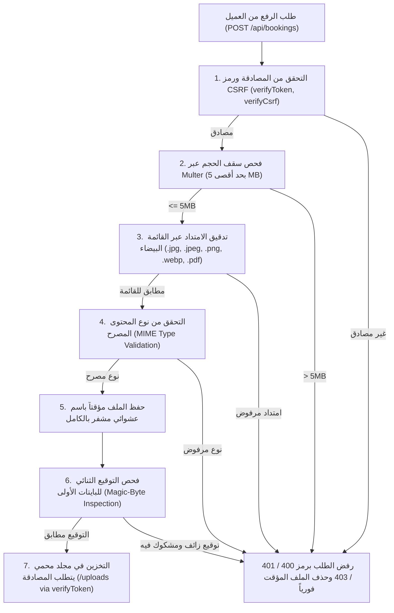

# 7 - Secure File Uploads

[← العودة إلى الفصل 6: BOLA / IDOR Remediation](06-bola-idor-remediation.md) | [الفصل التالي: Security Testing →](08-security-testing.md)

---

## 7.1 Overview (نظرة عامة على أمان رفع الملفات)

تتيح إجراءات حجز باقات السفر والتأشيرات للعملاء إمكانية إرفاق وثائق الهوية وصور جوازات السفر الخاصة بهم. وفي النسخة الأولية للمنصة، كانت عملية رفع الملفات تتم عبر مكتبة Multer بإعداداتها الافتراضية المفتوحة دون وضع سقوف للحجم، مع الوثوق التام بالبيانات الوصفية التي يرسلها المتصفح، وإتاحة الملفات المحفوظة للتصفح العام على شبكة الإنترنت.

ومن خلال معالجة الثغرة **SEC-04**، تمت إعادة هيكلة خط أنابيب رفع الملفات بالكامل ليعتمد على منظومة دفاعية متعددة الطبقات تفرض حدوداً صارمة على الحجم، قائمة بيضاء للمطابقة، فحصاً للتوقيع الثنائي الحقيقي (Magic Bytes)، توليد أسماء عشوائية مشفرة، وفرض المصادقة الإلزامية على قراءة الملفات المحفوظة.

---

## 7.2 The Original Weakness (طبيعة نقاط الضعف السابقة)

قبل معالجة الثغرة، تضمن مسار رفع الملفات في `server/index.js` خمس ثغرات حرجة:

1. **انعدام تحديد حجم الملفات (No Size Limit):** كان الخادم يقبل ملفات بأحجام غير محدودة؛ مما كان يجعله عرضة لهجمات استهلاك مساحة القرص الصلب والتسبب في حجب الخدمة (Disk Exhaustion DoS).
2. **الوثوق بامتداد اسم الملف القادم من العميل:** توليد اسم الملف عبر دمج التاريخ مع الامتداد الأصلي الذي يرسله العميل (`path.extname(file.originalname)`).
3. **غياب التحقق من نوع المحتوى (No MIME-Type Validation):** غياب أي مرشح يتحقق مما إذا كان الملف صورة أو وثيقة معتمدة.
4. **غياب فحص التوقيع الثنائي (No Magic-Byte Validation):** إمكانية رفع ملف تنفيذي أو سكريبت خبيث (`.php` أو `.sh` أو ملف `.html` يحتوي على JavaScript خبيث) بمجرد تغيير امتداده ظاهرياً إلى `.jpg`.
5. **إتاحة التخزين للعامة (Publicly Accessible Storage):** توفير مجلد `./uploads/` كمسار استاتيكي عام عبر `express.static('uploads')` دون أي قيود مصادقة، مما جعل وثائق وجوازات العملاء قابلة للقراءة والتحميل بواسطة أي زاحف ويب خارجي.

---

## 7.3 Multi-Stage Upload Validation Pipeline (خط أنابيب التحقق والتدقيق)

تخضع الملفات المرفوعة حالياً لسبع مراحل متتالية من التدقيق الهندسي الصارم:



---

## 7.4 Formal Limits and Whitelists (الحدود الفنية والقوائم البيضاء)

يطبق النظام القيود والمعايير المحددة التالية:

### 1. الحد الأقصى لحجم الملف (Maximum File Size)
- **السقف الصارم المسموح به:** `5 * 1024 * 1024` بايت (**5 MB**).
- أي ملف يتجاوز هذا السقف يتم إيقافه على الفور بواسطة Multer ويُرجع الخادم استجابة:
  ```json
  { "error": "File size exceeds the 5MB limit" }
  ```

### 2. قائمة الامتدادات المسموح بها (Allowed Extensions)
يتم قبول خمسة امتدادات معتمدة فقط:
- `.jpg`
- `.jpeg`
- `.png`
- `.webp`
- `.pdf`

ويتم رفض أية امتدادات أخرى (مثل `.exe`, `.sh`, `.html`, `.svg`, `.php`, `.js`, `.zip`) بشكل قاطع برمز `HTTP 400 Bad Request`.

### 3. قائمة أنواع المحتوى المعتمدة (Allowed MIME Types)
تتم مطابقة ترويسة `Content-Type` مع قائمة بيضاء حصرية:
- `image/jpeg`
- `image/png`
- `image/webp`
- `application/pdf`

### 4. التحقق من التوقيع الثنائي (Magic-Byte Signature Inspection)
لإحباط هجمات التزييف (مثل إعادة تسمية سكريبت خبيث إلى `passport.jpg`)، يقوم الخادم بعد كتابة الملف المؤقت بقراءة أول 16 بايت من الملف وفحص البصمة الثنائية للتأكد من مطابقتها لمعايير صيغ الملفات الحقيقية:

```javascript
function validateFileSignature(filePath) {
    const buffer = Buffer.alloc(16);
    let bytesRead = 0;
    try {
        const fd = fs.openSync(filePath, 'r');
        bytesRead = fs.readSync(fd, buffer, 0, 16, 0);
        fs.closeSync(fd);
    } catch (e) {
        return { valid: false, error: 'Cannot read file' };
    }

    if (bytesRead < 4) return { valid: false, error: 'File too small' };

    // توقيع JPEG: FF D8 FF
    if (buffer[0] === 0xFF && buffer[1] === 0xD8 && buffer[2] === 0xFF) {
        return { valid: true, type: 'image/jpeg' };
    }
    // توقيع PNG: 89 50 4E 47 0D 0A 1A 0A
    if (buffer[0] === 0x89 && buffer[1] === 0x50 && buffer[2] === 0x4E && buffer[3] === 0x47) {
        return { valid: true, type: 'image/png' };
    }
    // توقيع PDF: %PDF- (25 50 44 46 2D)
    if (buffer[0] === 0x25 && buffer[1] === 0x50 && buffer[2] === 0x44 && buffer[3] === 0x46) {
        return { valid: true, type: 'application/pdf' };
    }
    // توقيع WebP: RIFF في البداية و WEBP عند الإزاحة 8
    if (
        buffer[0] === 0x52 && buffer[1] === 0x49 && buffer[2] === 0x46 && buffer[3] === 0x46 &&
        buffer[8] === 0x57 && buffer[9] === 0x45 && buffer[10] === 0x42 && buffer[11] === 0x50
    ) {
        return { valid: true, type: 'image/webp' };
    }

    return { valid: false, error: 'Invalid file signature' };
}
```

إذا فشل فحص البصمة، يتم حذف الملف فورياً من القرص عبر `fs.unlinkSync()` ويُرجع الخادم الخطأ التالي:
```json
{ "error": "Invalid file content: file signature does not match allowed types (spoofed file rejected)" }
```

### 5. الأسماء العشوائية المشفرة (Cryptographic Random Filenames)
يتم تجاهل اسم الملف الأصلي القادم من العميل بشكل كامل، ويتم توليد اسم فريد جديد يتكون من التوقيت الزمني و 16 بايت مشفر عشوائياً باستخدام مكتبة `crypto`:
```javascript
const safeName = `${Date.now()}-${crypto.randomBytes(16).toString('hex')}${ext}`;
```
يحول هذا الإجراء دون إمكانية تنفيذ هجمات Path Traversal (مثل محاولة تمرير `../../etc/passwd` أو `..\windows\system32`).

### 6. حماية مسار الملفات (Protected Upload Storage)
تم تأمين مسار تقديم الملفات الاستاتيكية بربطه بطبقة فحص المصادقة `verifyToken`:
```javascript
// الكود المصحح في server/index.js
app.use('/uploads', verifyToken, express.static('uploads'));
```
أي طلب قادم دون جلسة مصادقة صالحة يُرفض فوراً برمز `HTTP 401 Unauthorized`، مما يمنع استعراض صور الجوازات من قِبل أي متطفل على الإنترنت.

---

## 7.5 Verification & Security Test Suite (حزمة اختبارات التحقق من رفع الملفات)

تم التحقق من صمود وأمان خط أنابيب رفع الملفات عبر **40 اختباراً مؤتمتاً**:

| فئة الاختبار (Test Category) | سيناريو الاختبار المستهدف (Target Scenario) | السلوك المتوقع (Expected Behavior) | حالة التحقق (Status) |
|---|---|---|:---:|
| **Valid Image Upload** | رفع صورة JPEG حقيقية بحجم أقل من 5MB | قبول الملف وحفظه باسم عشوائي (201 Created) | **PASS** |
| **Valid PDF Upload** | رفع وثيقة PDF حقيقية بحجم أقل من 5MB | قبول الملف وحفظه بنجاح (201 Created) | **PASS** |
| **Valid WebP Upload** | رفع صورة WebP حقيقية بحجم أقل من 5MB | قبول الملف وحفظه بنجاح (201 Created) | **PASS** |
| **Oversized File** | محاكاة رفع ملف بحجم 6 MB | اعتراض الرفع عبر Multer برمز 400 Bad Request | **PASS** |
| **Executable Extension** | محاولة رفع ملف تنفيذي `.exe` أو سكريبت `.sh` | الرفض عبر مرشح الامتدادات برمز 400 Bad Request | **PASS** |
| **Web Script Extension** | محاولة رفع ملف `.html` أو `.svg` خبيث | الرفض التام برمز 400 Bad Request ومنع هجوم XSS | **PASS** |
| **Spoofed Signature** | ملف نصي تم تغيير امتداده إلى `.jpg` | فشل فحص Magic Bytes وحذف الملف فورياً (400 Bad Request) | **PASS** |
| **Corrupted Image** | ملف بايتات مشوه وأقل من 4 بايت | فشل فحص البصمة الثنائية برمز 400 Bad Request | **PASS** |
| **Path Traversal Attempt** | محاولة تسمية الملف: `../../evil.png` | تجاهل الاسم وحفظه باسم عشوائي في `./uploads/` | **PASS** |
| **Missing CSRF Token** | رفع ملف صالح دون ترويسة `X-CSRF-Token` | حظر الطلب برمز 403 Forbidden | **PASS** |
| **Unauthenticated Upload** | محاولة رفع ملف دون كوكي `authToken` | حظر الطلب برمز 401 Unauthorized | **PASS** |
| **Unauthenticated Read** | محاولة استعراض ملف من `/uploads/` دون مصادقة | اعتراض الطلب عبر `verifyToken` برمز 401 Unauthorized | **PASS** |

### Result (النتيجة)
**VERIFIED:** اجتياز 40 من أصل 40 اختباراً بنجاح كامل دون أي إخفاق. أثبتت منظومة الفحص قدرتها على صد الملفات التنفيذية الضارة، محاولات استهلاك مساحة التخزين، التزييف الثنائي، وتسريب وثائق الجوازات.

---

## 7.6 Next Chapter (الفصل التالي)

انتقل لمراجعة استراتيجية الاختبارات الأمنية والأعداد التفصيلية لنتائج التحقق:  
👉 **[8 - Security Testing](08-security-testing.md)**
