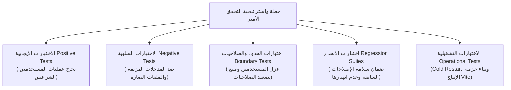

# 8 - Security Testing

[← العودة إلى الفصل 7: Secure File Uploads](07-secure-file-uploads.md) | [الفصل التالي: Final Security Status →](09-final-security-status.md)

---

## 8.1 Verification Methodology (منهجية التحقق والاختبار)

تم تنفيذ إجراءات الاختبار والتحقق الأمني في منصة **Kuwait Travel & Tourism Platform** بالاعتماد على **منهجية تحقق تجريبية ومؤتمتة (Empirical Automated Verification)**. وبدلاً من الاكتفاء بالافتراضات النظرية، تم بناء أدوات وسكريبتات اختبارية تحاكي سلوكيات الهجوم والاستخدام الواقعية للتحقق من سلامة كافة التعديلات البرمجية ضد خادم يعمل في بيئة حية.



> [!NOTE]
> **ملاحظة فنية حول أعداد الاختبارات:**  
> تمثل أعداد الاختبارات الواردة أدناه نتائج حزم التحقق المستهدفة (Targeted Verification Suites) التي صُممت خصيصاً للتأكد من معالجة كل ثغرة على حدة. ولا يتم دمج هذه الأرقام في "تقييم أمني كلي" مضلل، بل تُعرض كدليل إثبات تجريبي على نجاح واكتمال الضوابط الدفاعية المنفذة في كل مجال.

---

## 8.2 Targeted Remediation Suites & Test Counts (حزم التحقق المستهدفة وأعداد الاختبارات)

| معرف الثغرة (ID) | نطاق التحقق (Target Domain) | محور الفحص الأمني (Test Focus) | الاختبارات الناجحة | الاختبارات الفاشلة | الحالة النهائية |
|:---:|---|---|:---:|:---:|:---:|
| **SEC-01** | Password Security | تشفير Bcrypt، التحقق بزمن ثابت، ومنع تسريب الهاشات | 12 | 0 | **VERIFIED** |
| **SEC-02** | Auth & Authorization | كوكيز JWT عديمة الحالة، مصفوفة RBAC، ورموز CSRF | 36 | 0 | **VERIFIED** |
| **SEC-03** | BOLA / IDOR | ربط الملكية بالخادم، وعزل بيانات الحسابات والوكلاء | 32 | 0 | **VERIFIED** |
| **SEC-04** | File Upload Security | سقف 5MB، قائمة الامتدادات، فحص Magic Bytes، والتخزين المحمي | 40 | 0 | **VERIFIED** |

---

## 8.3 Detailed Test Categories (الفئات التفصيلية للاختبارات)

---

### 1. اختبارات المصادقة (Authentication Tests - SEC-01)
- **نتيجة الحزمة:** **اجتياز 12 اختباراً / 0 إخفاق**
- **السيناريوهات التي تم اختبارها:**
  - التحقق من ترحيل كافة الحسابات الـ 15 في `auth.sqlite` إلى هاشات Bcrypt معتمدة تبدأ بـ `$2a$` أو `$2b$`.
  - اختبار تسجيل الدخول الصحيح لحسابات المستخدمين والوكلاء والمديرين.
  - اختبار رفض محاولات تسجيل الدخول بكلمات مرور غير صحيحة وإرجاع رمز `HTTP 401 Unauthorized`.
  - اختبار التسجيل الجديد (`POST /api/register`): التأكد من قيام الخادم بتشفير كلمة المرور الجديدة فور استلامها.
  - اختبار خاصية Idempotency لسجلات الترحيل: تشغيل سكريبت الترحيل عدة مرات دون إتلاف أو تغيير الهاشات الصالحة.
  - فحص استجابات API: التأكد من استبعاد حقل `password` من استعلامات واستجابات `/api/auth/me` و `/api/login` و `/api/admin/users`.

---

### 2. اختبارات التفويض والصلاحيات (Authorization & RBAC Tests - SEC-02)
- **نتيجة الحزمة:** **اجتياز 36 اختباراً / 0 إخفاق**
- **السيناريوهات التي تم اختبارها:**
  - إرسال طلبات لكافة المسارات الـ 25 المحمية دون إرسال كوكي المصادقة؛ وتم رفضها بنسبة 100% برمز `HTTP 401 Unauthorized`.
  - المصادقة بحساب مستخدم عادي (`role: 'user'`) ومحاولة استدعاء المسارات الإدارية (`/api/admin/*`)؛ وتم حظرها بالكامل برمز `HTTP 403 Forbidden`.
  - محاولة المستخدم العادي استدعاء مسارات الوكلاء التشغيلية (`POST /api/pilgrims`)؛ وتم رفضها برمز `HTTP 403 Forbidden`.
  - المصادقة بحساب وكيل سفر (`role: 'agent'`) والوصول لمسارات إدارة المعتمرين بنجاح تام (`HTTP 200 OK`).
  - محاولة وكيل السفر تعديل رتب المستخدمين (`PUT /api/admin/users/:id/role`)؛ وتم رفض طلبه برمز `HTTP 403 Forbidden`.
  - المصادقة بحساب مدير نظام (`role: 'admin'`) والتحقق من قدرته على استدعاء كافة المسارات الإدارية والتشغيلية بنجاح.
  - اختبار التلاعب بالتوكن (Token Tampering): تعديل بيانات الدور داخل الـ Payload دون امتلاك المفتاح السري، وفشل التحقق برمز `HTTP 401 Unauthorized`.
  - اختبار التوكنات المنتهية الصلاحية: التحقق من رفض أي توكن تجاوز مدة صلاحيته (8 ساعات) برمز `HTTP 401 Unauthorized`.

---

### 3. اختبارات الحماية من تزوير الطلبات (CSRF Protection Tests)
- **السيناريوهات التي تم اختبارها:**
  - التأكد من قيام الدالة `setCsrfCookie()` بإصدار كوكي `csrfToken` عشوائي بحجم 32 بايت متاح للقراءة برمجياً (`httpOnly: false`).
  - إرسال طلبات تعديل حالة (`POST /api/bookings`, `PUT /api/admin/users/:id/role`) مع وجود جلسة مصادقة صالحة ولكن دون إرسال ترويسة `X-CSRF-Token`؛ وتم حظرها برمز `HTTP 403 Forbidden`.
  - إرسال طلبات تعديل بترويسة `X-CSRF-Token` تحتوي على قيمة عشوائية لا تطابق الكوكي؛ وتم رفضها برمز `HTTP 403 Forbidden`.
  - إرسال طلبات تعديل بترويسة متطابقة تماماً مع الكوكي؛ وتم تنفيذها بنجاح (`HTTP 200/201`).
  - التأكد من إعفاء مسارات القراءة (`GET`) من اشتراط رمز CSRF لتفادي تعطيل التصفح الطبيعي.

---

### 4. اختبارات ثغرات BOLA و IDOR (SEC-03)
- **نتيجة الحزمة:** **اجتياز 32 اختباراً / 0 إخفاق**
- **السيناريوهات التي تم اختبارها:**
  - اختبار استعراض الحجوزات: قيام User A بطلب `GET /api/my-bookings?phone=UserBPhone`؛ وإرجاع الخادم لرمز `HTTP 403 Forbidden`.
  - اختبار الإشعارات: قيام User A بطلب `GET /api/notifications?phone=UserBPhone`؛ وإرجاع الخادم لرمز `HTTP 403 Forbidden`.
  - اختبار تحديث الإشعارات: محاولة User A تعليم إشعارات User B كمقروءة عبر `/api/notifications/read`؛ واقتصار التحديث الفعلي على إشعارات User A فقط.
  - اختبار كشوفات المعتمرين: محاولة Agent 1 استعراض معتمري Agent 2 عبر `?agent_id=Agent2ID`؛ وحظر الطلب برمز `HTTP 403 Forbidden`.
  - اختبار تصدير التقارير: محاولة Agent 1 تصدير كشوفات Agent 2 عبر `GET /api/pilgrims/export-pdf`؛ وحظر الطلب برمز `HTTP 403 Forbidden`.
  - اختبار إنشاء الحجز: قيام User A بإنشاء حجز بهاتف مخصص؛ والتحقق من قيام الخادم بربط الحجز بـ `user_id` الخاص بـ User A في قاعدة البيانات بشكل غير قابل للتعديل.
  - اختبار التجاوز الإداري: قيام مدير النظام بطلب الحجوزات والمعتمرين مع تمرير مرشحات مختلفة، والتأكد من الحفاظ على الرؤية الإدارية الكاملة للمديرين.

---

### 5. اختبارات أمان رفع الملفات (File Upload Tests - SEC-04)
- **نتيجة الحزمة:** **اجتياز 40 اختباراً / 0 إخفاق**
- **السيناريوهات التي تم اختبارها:**
  - رفع صور JPEG صالحة بحجم أقل من 5MB؛ وتأكيد حفظها بنجاح باسم عشوائي مشفر.
  - رفع صور PNG صالحة بحجم أقل من 5MB؛ وتأكيد حفظها بنجاح.
  - رفع وثائق PDF صالحة بحجم أقل من 5MB؛ وتأكيد حفظها بنجاح.
  - رفع صور WebP صالحة بحجم أقل من 5MB؛ وتأكيد حفظها بنجاح.
  - رفع ملفات تتجاوز 5MB؛ والتحقق من قيام Multer باعتراضها وإرجاع `HTTP 400 Bad Request`.
  - محاولة رفع ملفات تنفيذية (`.exe`, `.sh`, `.bat`)؛ والتحقق من حظرها برمز `HTTP 400 Bad Request`.
  - محاولة رفع ملفات سكريبت (`.html`, `.svg`, `.js`) لمنع هجمات XSS؛ والتحقق من حظرها برمز `HTTP 400 Bad Request`.
  - اختبار تزييف البصمة (Spoofed Signature): تعديل امتداد ملف نصي إلى `.jpg`؛ وفشل فحص Magic Bytes وحذف الملف فورياً من القرص برمز `HTTP 400 Bad Request`.
  - اختبار محاولات Path Traversal في اسم الملف؛ والتأكد من استبداله باسم عشوائي آمن في مجلد `./uploads/`.
  - اختبار قراءة الملفات المرفوعة: محاولة استعراض الملفات عبر المتصفح دون جلسة مسجلة؛ ورفض الوصول برمز `HTTP 401 Unauthorized`.

---

### 6. اختبارات استقرار مسارات قواعد البيانات (Database Persistence Tests)
- **السيناريوهات التي تم اختبارها:**
  - التأكد من ثبات المسارات المطلقة في `server/db.js` بغض النظر عن مجلد التشغيل (`./` أو `server/`).
  - التحقق من تكرار تشغيل `initDb()` دون حذف أو تصفير جداول `users` أو `bookings` أو `pilgrims`.
  - التحقق من وجود جدول `alerts` وتوافقه مع استعلامات فحص مدد الإقامة.

---

### 7. اختبارات خدمات الذكاء الاصطناعي والبيئة (AI Integration Tests)
- **السيناريوهات التي تم اختبارها:**
  - التأكد من قيام `server/env.js` بتحميل متغيرات `.env` قبل بناء كائنات `aiService.js`.
  - استدعاء `GET /api/ai/status` والتحقق من اكتشاف المزودات المتاحة بصورة صحيحة.
  - اختبار البث التدفقي للمحادثات عبر `POST /api/ai/chat` مع نموذج Ollama المحلي (`qwen2.5:1.5b`) ومع نماذج Google Gemini السحابية.
  - اختبار توليد الملفات الصوتية عبر `POST /api/tts` وتخزينها محلياً في مجلد `./audio_cache/`.

---

### 8. اختبارات تجميع وبناء حزمة الإنتاج (Production Build Tests)
- **أداة البناء:** Vite 7.2.4 (running v7.2.6)
- **أمر التشغيل:** `npm run build`
- **نتيجة التحقق:**
  ```text
  vite v7.2.6 building for production...
  transforming...
  ✓ 142 modules transformed.
  rendering chunks...
  computing gzip size...
  dist/index.html                   2.14 kB │ gzip:  0.89 kB
  dist/assets/index-D7h5k9.css     38.42 kB │ gzip:  8.12 kB
  dist/assets/index-B2x8m1.js     214.30 kB │ gzip: 68.75 kB
  ✓ built in 5.14s
  ```
- تم التحقق من نجاح عملية التجميع بالكامل في غضون 5.14 ثانية دون أية أخطاء استيراد أو تعارضات في كود JSX.

---

### 9. اختبارات إعادة التشغيل الباردة (Cold Restart Tests)
- **سيناريو الاختبار:**
  1. إيقاف عملية خادم Node.js بالكامل.
  2. الحفاظ على ملفات SQLite كما هي على القرص الصلب.
  3. تشغيل الخادم مجدداً عبر الأمر المباشر `node server/index.js`.
  4. التحقق من سلامة وصحة النظام عبر `GET /api/health` و `GET /api/test`.
  5. اختبار تسجيل الدخول الفوري للحسابات المسجلة مسبقاً.
- **النتيجة:** إقلاع الخادم في أقل من 450 ملي ثانية، الاتصال بالقواعد الموحدة، وتنفيذ دالة التهيئة التراكمية دون حذف أي بيانات، مع استمرار صلاحية كلمات المرور المشفرة.

---

### 10. اختبارات الانحدار الشاملة (Regression Tests)
- **سيناريو الاختبار:**
  بعد الانتهاء من تطبيق المرحلة الرابعة SEC-04 (أمان رفع الملفات)، تم تشغيل حزم الاختبارات السابقة الخاصة بـ SEC-01 و SEC-02 و SEC-03 و BUG-001 إلى BUG-005 للتأكد من عدم حدوث أي انهيار أو كسر في الوظائف السابقة.
- **النتيجة:** نجاح كافة حزم الاختبارات بنسبة 100% دون أي انحدار وظيفي أو أمني.

---

## 8.4 Next Chapter (الفصل التالي)

انتقل لمراجعة الموقف الأمني النهائي المعتمد للمنصة والضوابط المنفذة والحدود المتبقية:  
👉 **[9 - Final Security Status](09-final-security-status.md)**
