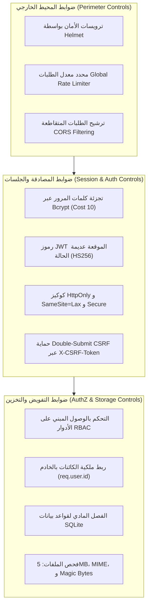

# 9 - Final Security Status

[← العودة إلى الفصل 8: Security Testing](08-security-testing.md) | [العودة إلى README الرئيسية →](../README.md)

---

## 9.1 Status Summary Matrix (مصفوفة الحالة الأمنية النهائية)

يوضح الجدول التالي الموقف النهائي المعتمد والمثبت لكافة العيوب الهندسية والتحسينات الأمنية التي خضعت للتصليب والتحقق التجريبي في منصة **Kuwait Travel & Tourism Platform**:

| معرف البند (ID) | نطاق المشكلة (Domain Area) | محور المعالجة الهندسية (Remediation Focus) | حالة التحقق (Status) |
|:---:|---|---|:---:|
| **BUG-001** | Data Persistence | إلغاء `DROP TABLE pilgrims` التدميري واعتماد Additive Migrations | **VERIFIED** |
| **BUG-002** | Schema Integrity | إنشاء مخطط جدول `alerts` في دالة التهيئة ومنع أخطاء 500 | **VERIFIED** |
| **BUG-003** | Database Paths | تثبيت مسارات مطلقة موحدة لملفات SQLite في `server/db.js` | **VERIFIED** |
| **BUG-004** | AI Environment | موديول التحميل الاستباقي لـ `.env` لتفادي Hoisting في ES Modules | **VERIFIED** |
| **BUG-005** | Credential Hygiene | عزل مفاتيح Google API وتدويرها وتوفير قالب `.env.example` | **VERIFIED** |
| **SEC-01** | Password Security | تشفير كلمات المرور بـ Bcrypt (Cost 10) ومنع تسريب الهاشات | **VERIFIED** |
| **SEC-02** | Auth & Authorization | كوكيز JWT من نوع HttpOnly، حماية CSRF، ومصفوفة RBAC للمسارات | **VERIFIED** |
| **SEC-03** | BOLA / IDOR | ربط استعلامات الحجوزات والإشعارات والمعتمرين بـ `req.user.id` | **VERIFIED** |
| **SEC-04** | File Upload Security | سقف 5MB، قائمة الامتدادات، فحص Magic Bytes، وحماية مجلد الرفع | **VERIFIED** |

---

## 9.2 What Was Verified (ما تم التحقق منه عملياً)

تم إثبات فاعلية كل معالجة من المعالجات المذكورة أعلاه عبر اختبارات برمجية دقيقة وملاحظة حية لسلوك الخادم:

1. **النزاهة التشفيرية لكلمات المرور:** استحالة استخراج أو قراءة كلمات المرور كنص صريح حتى لو تم تسريب قاعدة البيانات أو نسخها الاحتياطية، مع ضمان عدم تسرب الهاشات عبر استجابات API أو سجلات النظام.
2. **حدود التحكم بالوصول:** منع أي متصل غير مصرح له من استدعاء المسارات المحمية أو الإدارية، ومنع المستخدمين العاديين من ترقية أدوارهم أو استدعاء مسارات وكلاء السفر.
3. **عزل المستأجرين وسجلات المستخدمين:** قصر وصول العملاء إلى سجلات حجوزاتهم وإشعاراتهم الخاصة فقط، ومنع وكلاء السفر من استعراض أو تصدير كشوفات المعتمرين التابعين للوكالات الأخرى.
4. **أمان خط أنابيب الملفات المرفوعة:** عجز المهاجمين عن رفع ملفات تتجاوز 5MB، أو رفع ملفات تنفيذية وسكريبتات ضارة، أو تزييف البصمات الثنائية للملفات، مع منع استعراض وثائق الجوازات لغير المصادق عليهم.
5. **الاستقرار التشغيلي:** قدرة الخادم على الإقلاع التام بعد التوقف الكامل (Cold Restart) دون فقدان للبيانات، ونجاح بناء الواجهة الأمامية للإنتاج (`npm run build`) بنسبة 100%.

---

## 9.3 Security Controls Implemented (الضوابط الأمنية المطبقة)

تتكامل الضوابط الأمنية للمنصة في بنية دفاعية متعددة الطبقات:

---

## 9.4 Remaining Limitations & Technical Debt (الحدود التقنية والتحسينات المتبقية)

بالرغم من القفزة الهندسية والأمنية الكبيرة التي حققها المشروع، **فإنه لا يُزعم بأي شكل من الأشكال أن التطبيق نظام معتمد كلياً أو محصن بنسبة 100% (Production-Certified Secure System)**. 

تظل النقاط والحدود الهندسية التالية موثقة بشفافية تامة للتطوير في المراحل القادمة:

### 1. SEC-06: تضارب محدد معدل الطلبات مع الاستعلام الدوري للإشعارات
- **الوضع الحالي:** تم تطبيق حد عالمي قدره 100 طلب لكل 15 دقيقة لكل IP. في المقابل، تقوم الواجهة الأمامية بالاستعلام كل 10 ثوانٍ عن الإشعارات (ما يعادل 90 طلباً في 15 دقيقة).
- **الأثر المحتمل:** المستخدم النشط الذي يتصفح المنصة لأكثر من 10 إلى 12 دقيقة قد يواجه خطأ حجب الخدمة المؤقت `HTTP 429 Too Many Requests`.
- **التحسين المخطط:** فصل حدود مسارات المصادقة عن مسارات الاستعلام العادية، أو استبدال الاستعلام الدوري (Polling) باتصالات لحظية قائمة على WebSockets أو Server-Sent Events (SSE).

### 2. SEC-07: سياسة CORS المفتوحة
- **الوضع الحالي:** يقوم الخادم بتفعيل `cors()` دون تقييد النطاقات الخارجية المسموح لها بالتواصل مع الخادم.
- **الأثر المحتمل:** على الرغم من أن جلسات المستخدمين محمية بـ `SameSite=Lax` واشتراط ترويسة CSRF يمنع هجمات التزوير، إلا أن السياسة المفتوحة تزيد من مساحة التعرض الشبكي غير الضرورية.
- **التحسين المخطط:** تقييد النطاقات المسموح بها في إعدادات CORS لتقتصر حصرياً على النطاق المعتمد للواجهة الأمامية في بيئة الإنتاج.

### 3. غياب آلية إبطال التوكنات المركزية (Token Revocation / Blacklist)
- **الوضع الحالي:** تعتمد المصادقة على رموز JWT عديمة الحالة (Stateless) بصلاحية 8 ساعات. عند تسجيل الخروج يتم حذف الكوكي من المتصفح، ولكن التوكن نفسه يظل صالحاً تشفيرياً إذا تم اعتراضه قبل انتهاء مدته.
- **التحسين المخطط:** إنشاء قائمة حظر مركزية خفيفة (Token Blacklist) في الذاكرة المؤقتة، أو الانتقال لنمط التوكنات قصيرة الأجل (15 دقيقة) مع استخدام Refresh Tokens.

### 4. تصدير التقارير كملفات HTML بدلاً من PDF الثنائية
- **الوضع الحالي:** يقوم المسار `/api/pilgrims/export-pdf` بتوليد ملف HTML منسق لطباعة التقارير باللغة العربية بدلاً من ملف PDF ثنائي مباشر، نظراً لعدم توفر حزم التجميع الخاصة بـ `pdfkit`.
- **التحسين المخطط:** دمج محرك توليد PDF حقيقي مثل `puppeteer` في خط الإنتاج.

### 5. محاكاة بوابات إرسال الرسائل القصيرة (SMS Gateway Integration)
- **الوضع الحالي:** تنبيهات انتهاء التأشيرات ورسائل الكفلاء تكتفي بالطباعة في سجلات الخادم (Console Log) ولا تُرسل كرسائل SMS حقيقية.
- **التحسين المخطط:** ربط الخادم ببوابة رسائل معتمدة مثل Twilio أو مزود محلي كويتي لرسائل SMS.

---

## 9.5 Verified Remediation vs. Complete Security Assurance (التصحيح المعتمد مقابل الضمان الأمني الشامل)

> [!WARNING]
> **حدود النطاق الهندسي والواقع العملي:**  
> يمثل العمل الموثق في هذا المشروع **معالجة مستهدفة ومثبتة عملياً (Verified Targeted Remediation)** لنقاط الضعف المحددة التي كشف عنها التدقيق (SEC-01 إلى SEC-04 و BUG-001 إلى BUG-005).  
> 
> والمقصود بـ "Verified Remediation" هو أن كل ثغرة مستهدفة خضعت للتحليل الدقيق، وعزل سببها الجذري، وتصحيحها بالحد الأدنى الآمن من الكود، وإثبات نجاح الحل عبر اختبارات مؤتمتة واختبارات انحدار.  
> 
> ولا يعني ذلك الحصول على شهادة اعتماد أمني رسمية (مثل SOC 2 أو ISO 27001) أو خضوع النظام لاختبار اختراق خارجي موسع (Third-Party Penetration Testing). فالأمن السيبراني عملية هندسية مستمرة تتطلب مراقبة الاعتماديات، التدقيق الدوري، ونشر التطبيق خلف بنية تحتية آمنة.

---

## 9.6 Engineering Conclusion (الخلاصة الهندسية)

يمثل مشروع منصة الكويت للسياحة والسفر نموذجاً عملياً لتطبيق الهندسة الأمنية المسؤولة في تطوير تطبيقات الويب:

$$\text{Build} \longrightarrow \text{Assess} \longrightarrow \text{Remediate} \longrightarrow \text{Test} \longrightarrow \text{Document}$$

إن تشخيص الأسباب الجذرية، وتطبيق الحلول البرمجية المصمتة، وتأكيد النتائج بالاختبارات التجريبية، وتوثيق المعمارية بحدودها الواقعية، يعكس النهج الهندسي الرصين المطلوب في حماية وتطوير برمجيات الويب الحديثة.

---

[← العودة إلى الفصل 8: Security Testing](08-security-testing.md) | [العودة إلى README الرئيسية →](../README.md)
