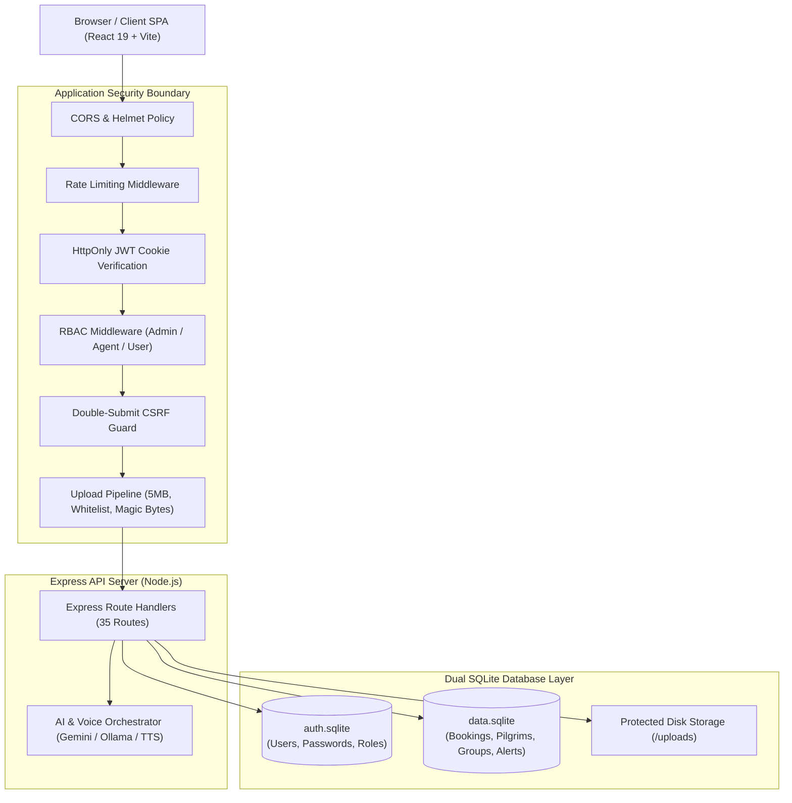

# Kuwait Travel & Tourism Platform

> **Full-Stack Travel Management Platform with Application Security Assessment & Hardening**

---

## 1. Overview (نظرة عامة)

منصة **Kuwait Travel & Tourism Platform** (`kuwait-travel`) هي تطبيق ويب متكامل (Full-Stack Web Application) مصمم لإدارة عمليات وكالات السفر والسياحة، حجوزات المسافرين، ومتابعة أفواج المعتمرين والحجاج، بالإضافة إلى لوحة تحكم إدارية متقدمة ومساعد صوتي ذكي مدعوم بتقنيات الذكاء الاصطناعي (AI Voice Assistant).

تم تطوير المشروع في البداية كنموذج أولي عملي (Functional Prototype)، ثم خضع لعملية تدقيق أمني شاملة (**Application Security Assessment**) وتصليب هندسي تدريجي (**System Hardening**). ومن خلال منهجية هندسية دقيقة تعتمد على تحليل السبب الجذري (**Root Cause Analysis**)، والحلول البرمجية الآمنة بالحد الأدنى (**Minimal Safe Fixes**)، واختبارات التحقق المؤتمتة (**Targeted & Regression Testing**)، تمت معالجة ثغرات حرجة مثل تخزين كلمات المرور كنص صريح (Plaintext Passwords)، الغياب التام لآليات Authorization في Backend، وثغرات Broken Object-Level Authorization (BOLA/IDOR)، والرفع غير المقيد للملفات (Unrestricted File Upload).

---

## 2. Main Features (الميزات الأساسية)

- **بوابة السفر العامة (Public Travel Portal):** استعراض العروض والرحلات السياحية المنظمة (دبي، القاهرة، إسطنبول، ماليزيا، مكة المكرمة، والمدينة المنورة)، متطلبات التأشيرات، ونماذج التواصل التفاعلية.
- **نظام الحجوزات المتكامل (Booking Management):** محرك حجوزات متعدد الخدمات يشمل رحلات الطيران، الفنادق، التأشيرات، تجديد الجوازات، وحجوزات العمرة، مع رفع وتدقيق مستندات الجوازات.
- **منظومة متابعة المعتمرين (Pilgrim Tracking System):** لوحة تشغيلية مخصصة لوكلاء السفر (Travel Agents) لمراقبة مدة إقامة المعتمرين داخل المملكة العربية السعودية، وحساب الأيام المتبقية آلياً مقابل الحد الأقصى لصلاحية التأشيرة (90 يوماً)، وإطلاق تنبيهات استباقية عند تجاوز 70 يوماً.
- **إدارة الصلاحيات والأدوار (Role-Based Portals):** عزل تام ومحكم بين بوابات المستخدمين العاديين (`user`)، وكلاء السفر (`agent`)، ومديري النظام (`admin`).
- **المساعد الصوتي والذكاء الاصطناعي (AI Voice Assistant):** مساعد تفاعلي متعدد النماذج يدعم المعالجة الصوتية باللغة العربية عبر Web Speech API، مع إمكانية الربط السحابي بـ Google Gemini أو التشغيل المحلي بـ Ollama مع خاصية Text-to-Speech (TTS).
- **نظام الإشعارات الموجهة (Notifications System):** بث تنبيهات فورية للمستخدمين والإداريين حول تطورات الحجوزات، جاهزية التأشيرات، وتنبيهات مدد إقامة المعتمرين.

---

## 3. Technology Stack (حزمة التقنيات)

| الطبقة (Layer) | التقنيات المستخدمة (Technologies) |
|---|---|
| **Frontend** | React 19, React Router 7, Vite 7, Vanilla CSS, Web Speech API |
| **Backend API** | Node.js (ES Modules), Express 5, Multer, Cookie-Parser, Helmet, Express-Rate-Limit |
| **Authentication & AuthZ** | Stateless JWT (`jsonwebtoken`), `bcryptjs` (Cost Factor 10), Double-Submit CSRF Cookies |
| **Databases** | SQLite3 (`auth.sqlite` لإدارة Identity، و `data.sqlite` للعمليات التشغيلية) |
| **AI & NLP** | Google Gemini API (`@google/genai`), Ollama API, LangChain core integrations |
| **Security Controls** | `HttpOnly` / `SameSite=Lax` cookies, Magic Bytes signature validation, BOLA ownership binding |

---

## 4. High-Level Architecture (الهيكلية العامة للنظام)

يعتمد النظام مبدأ الفصل المادي للبيانات (Physical Database Segregation) عبر قاعدتي بيانات SQLite منفصلتين تماماً، مع توفير خادم Express API مركزي يرتبط بالواجهة الأمامية المعتمدة على React Single Page Application (SPA):

---

## 5. Security Engineering Workflow (منهجية الهندسة الأمنية)

تم تطبيق منهجية هندسية دورية وصارمة بدلاً من التعديلات العشوائية المؤقتة:

$$\text{Build} \longrightarrow \text{Assess} \longrightarrow \text{Reproduce} \longrightarrow \text{Analyze} \longrightarrow \text{Remediate} \longrightarrow \text{Test} \longrightarrow \text{Document}$$

1. **System Understanding (فهم النظام):** فحص عميق للكود المصدري، مسارات Express، وسلاسل Middleware، وبنية قواعد البيانات.
2. **Vulnerability Reproduction (إعادة إنتاج الثغرة):** بناء سيناريوهات واختبارات واقعية تؤكد وجود الخلل الأمني أو الوظيفي وتوثق سلوكه.
3. **Root Cause Analysis (تحليل السبب الجذري):** عزل الخلل المعماري الحقيقي في الكود أو الإعدادات بعيداً عن مجرد معالجة الأعراض السطحية.
4. **Minimal Safe Remediation (الإصلاح الآمن بالحد الأدنى):** إجراء تعديلات برمجية مركزة تعالج المشكلة دون المساس بالمنطق التشغيلي للتطبيق.
5. **Targeted Testing (الاختبار المستهدف):** تنفيذ اختبارات إيجابية، سلبية، واختبارات تلاعب للتحقق من صمود الحل الأمني.
6. **Regression Testing (اختبار الانحدار):** إعادة تشغيل حزم الاختبار السابقة لضمان عدم حدوث أي انهيار أو تعارض وظيفي، مع التحقق من استقرار النظام بعد Cold Restart وبناء Production Build.

---

## 6. Security Work Completed (الأعمال المنجزة)

يوضح الجدول التالي المشكلات الهندسية والثغرات الأمنية التي تم التحقق من معالجتها بالكامل:

| المعرف (ID) | نطاق المشكلة (Domain) | الحالة الأولية (Initial State) | الحالة بعد الإصلاح (Remediated State) | الحالة (Status) |
|---|---|---|---|:---:|
| **BUG-001** | Data Persistence | فقدان بيانات المعتمرين عند إعادة تشغيل الخادم | إلغاء `DROP TABLE` واعتماد Additive Migrations | **VERIFIED** |
| **BUG-002** | Schema Integrity | خطأ 500 لغياب جدول `alerts` في قاعدة البيانات | تعريف مخطط الجدول رسمياً داخل دورة تهيئة الخادم | **VERIFIED** |
| **BUG-003** | Database Paths | تشتت مسارات SQLite بسبب الاعتماد على المسارات النسبية | تثبيت مسارات مطلقة موحدة عبر `server/db.js` | **VERIFIED** |
| **BUG-004** | Environment Order | تعطل تهيئة AI بسبب Hoisting في ES Modules | إنشاء وحدة `server/env.js` لضمان تحميل `.env` أولاً | **VERIFIED** |
| **BUG-005** | Credential Hygiene | وجود مفاتيح Google API صريحة داخل الملفات | عزل المفاتيح بالكامل في `.env` وتوفير `.env.example` | **VERIFIED** |
| **SEC-01** | Password Security | تخزين كلمات المرور كنص صريح (Plaintext) | ترحيل شامل إلى Bcrypt (Cost 10) ومنع تسريب الهاشات | **VERIFIED** |
| **SEC-02** | Authentication / RBAC | انعدام تام لأي تحكم بالوصول في الـ Backend | اعتماد JWT في HttpOnly Cookies و CSRF Protection و RBAC | **VERIFIED** |
| **SEC-03** | BOLA / IDOR | الوثوق بمدخلات العميل مثل أرقام الهواتف والمعرفات | ربط استعلامات الحجوزات والمعتمرين بـ `req.user.id` | **VERIFIED** |
| **SEC-04** | File Upload Security | رفع ملفات غير مقيد ودون تدقيق امتداد أو حجم | فرض سقف 5MB وقائمة بيضاء وتدقيق Magic Bytes وحماية المجلد | **VERIFIED** |

---

## 7. Documentation (فهرس التوثيق)

تم تنظيم توثيق المشروع في تسعة فصول تخصصية مفصلة:

| الفصل | عنوان الوثيقة | المحتوى والتركيز الفني |
|---|---|---|
| **دليل التشغيل** | [Build & Setup Guide](BUILD.md) | دليل التثبيت، الإعداد، التشغيل، والبناء لبيئة عمل نظيفة |
| **الفصل 1** | [Project Overview](docs/01-project-overview.md) | النطاق العام، أهداف النظام، البنية التقنية، ومنهجية التقييم الأمني |
| **الفصل 2** | [System Architecture](docs/02-system-architecture.md) | تفاعل المكونات، فصل قواعد البيانات، وتدفقات Authentication و Authorization |
| **الفصل 3** | [Security Assessment](docs/03-security-assessment.md) | التدقيق الأمني المبدئي، مصفوفة التهديدات، وتحليل الأسباب الجذرية |
| **الفصل 4** | [System Hardening](docs/04-system-hardening.md) | معالجة العيوب الهندسية وإعدادات النظام (BUG-001 إلى BUG-005) |
| **الفصل 5** | [Authentication & Authorization](docs/05-authentication-and-authorization.md) | تفاصيل SEC-01 و SEC-02 (تشفير Bcrypt، كوكيز JWT، حماية CSRF، ومصفوفة المسارات) |
| **الفصل 6** | [BOLA / IDOR Remediation](docs/06-bola-idor-remediation.md) | تفاصيل SEC-03 (ربط الملكية، حماية البيانات الشخصية للمسافرين والمعتمرين) |
| **الفصل 7** | [Secure File Uploads](docs/07-secure-file-uploads.md) | تفاصيل SEC-04 (خط أنابيب رفع الملفات، فحص Magic Bytes، وتأمين التخزين) |
| **الفصل 8** | [Security Testing](docs/08-security-testing.md) | حزم الاختبارات المؤتمتة، نتائج الاختبارات العددية، واختبارات الانحدار |
| **الفصل 9** | [Final Security Status](docs/09-final-security-status.md) | الحالة الأمنية النهائية، الضوابط المنفذة، والحدود والتحسينات المتبقية |

---

## 8. Security Notes (ملاحظات أمنية هامة)

- **جلسات بدون حالة (Stateless JWT Sessions):** تعتمد المصادقة على رموز JWT موقعة ومحفوظة داخل HttpOnly Cookies. عند تسجيل الخروج، يرسل الخادم ترويسة مسح ملفات تعريف الارتباط مما يجعل المتصفح يتوقف عن إرسالها؛ علماً بأنه لا توجد آلية Blacklist مركزية في هذا التصميم عديم الحالة (Stateless).
- **عزل قواعد البيانات (Dual Database Pattern):** فصل بيانات الهوية والحسابات في `auth.sqlite` عن البيانات التشغيلية في `data.sqlite` يقلص دائرة الاستهداف (Blast Radius) ويمنع الوصول لكلمات المرور عند حدوث أي خلل في استعلامات البيانات العامة.
- **الدفاع في العمق (Defense in Depth):** يتطلب رفع الملفات المرور بعدة طبقات متتالية: التحقق من جلسة المستخدم (Authentication)، رمز CSRF، سقف الحجم المسموح، القائمة البيضاء للامتدادات و MIME Types، وفحص تواقيع الملفات الثنائية (Magic Bytes).

---

## 9. Project Status (حالة المشروع)

- **تدقيق أمان التطبيقات (Security Assessment):** مكتمل وموثق.
- **التصليب الأمني المستهدف (Targeted Hardening):** تم التحقق منه بالكامل للحالات SEC-01 إلى SEC-04.
- **الاختبارات المؤتمتة (Automated Verification):** تم اجتياز أكثر من 120 اختبار تحقق أمني واختبار انحدار بنجاح (0 إخفاقات).
- **جاهزية البناء (Production Build):** تم التحقق من نجاح أمر البناء (`npm run build`) بنسبة 100% دون أي أخطاء تجميع.

---

## 10. Purpose (الهدف من المشروع)

يُقدم هذا المشروع كـ **Portfolio هندسي وأمني تطبيقي**، يوضح الكفاءة في تطوير تطبيقات الويب الحديثة باستخدام تقنيات JavaScript/Node.js و React، مع تطبيق المعايير المتقدمة في نمذجة التهديدات (Threat Modeling)، وتقييم ثغرات تطبيقات الويب (OWASP Top 10)، وتنفيذ الحلول الأمنية المصمتة والمثبتة عملياً بالاختبارات.

---

*Build $\longrightarrow$ Assess $\longrightarrow$ Remediate $\longrightarrow$ Test $\longrightarrow$ Document*
